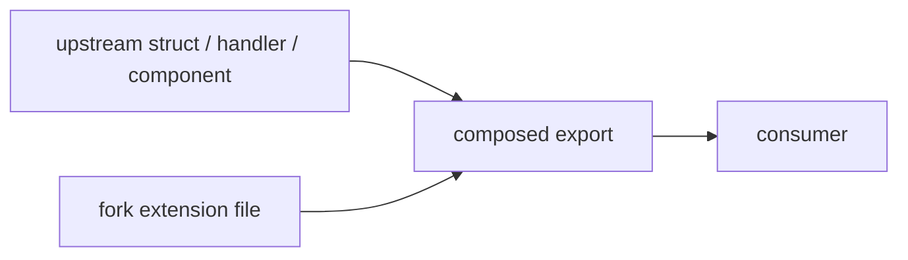

# Fork Architecture — reducing upstream merge surface

This document describes the conventions **unique to the `jamesainslie/t3code` fork** that keep syncs with upstream `pingdotgg/t3code` mechanical. It is fork-local and will not be upstreamed.

## Why this exists

Upstream `pingdotgg/t3code` churns heavily in three hotspots — `Sidebar.tsx`, `packages/contracts/src/orchestration.ts`, and `apps/server/src/ws.ts`. Our fork adds SSH remote environment support, deleted-project soft-delete, and related features that originally landed _inside_ those files. Every upstream sync produced hand-edited merge conflicts in each of them.

The fork-isolation plan (see `docs/plans/reduce-upstream-merge-conflict-surface.md`) extracted the fork-only code into sibling modules so upstream edits and fork edits no longer collide.

## The pattern

Fork-only code lives in dedicated files that upstream does not touch. Upstream files contain only upstream code. Composition happens at import time, not inside the upstream file.



### Adding a fork-only contract field

Upstream struct:

```ts
// packages/contracts/src/orchestration.ts — UPSTREAM-OWNED
export const BaseOrchestrationProject = Schema.Struct({ ...upstream fields... });
```

Fork extension:

```ts
// packages/contracts/src/fork/projectExtensions.ts — FORK-ONLY
export const ProjectForkFields = {
  remoteHost: Schema.optional(RemoteHost),
} as const;
```

Composed export:

```ts
// packages/contracts/src/fork/orchestration.ts — FORK-ONLY
export const OrchestrationProject = Schema.Struct({
  ...BaseOrchestrationProject.fields,
  ...ProjectForkFields,
});
```

Consumers import from `@t3tools/contracts` which re-exports the fork-composed type after the upstream re-export, so every consumer transparently gets the extended type.

### Adding a fork-only RPC method

The WebSocket server uses a method registry in `apps/server/src/rpc/registry.ts`. Fork methods are registered in `apps/server/src/rpc/handlers/fork.ts`, which is appended to the upstream registry. Do not edit `apps/server/src/ws.ts` — it is effectively a dispatch shim now.

### Adding a fork-only Sidebar feature

Extract the state machine or UI subtree into `apps/web/src/components/sidebar/<feature>.ts` and import from `Sidebar.tsx`. Prior art:

- `sidebar/useAddProjectFlow.ts` — add-project input + folder picker flow
- `sidebar/remoteGuards.ts` — `ensureRemoteConnected` guard
- `sidebar/buildRemoteContextMenuItems.ts` — remote project context menu

Prefer pure functions exported alongside the React hook so behavior can be tested without `@testing-library/react`.

## Conflict surface baseline

Measured against upstream `pingdotgg/t3code@main` (merge-base at the time of Phase 4):

| File                                      | Fork diff before | Fork diff after | Reduction |
| ----------------------------------------- | ---------------: | --------------: | --------: |
| `packages/contracts/src/orchestration.ts` |       ~320 lines |        88 lines |  **~72%** |
| `apps/server/src/ws.ts`                   |      ~1020 lines |    1087 lines\* |   ~0%\*\* |
| `apps/web/src/components/Sidebar.tsx`     |        518 lines |       272 lines |  **~47%** |

\*ws.ts line count went up slightly because the registry abstraction added scaffolding, but the fork-only logic no longer lives in that file — it is in `handlers/fork.ts`. Conflict frequency, not raw lines, is what matters here. See Phase 2 in the plan doc.

**Synthetic sync validation:** cherry-picking upstream `ce94feee feat: add opencode provider support` (which touches `packages/contracts/src/orchestration.ts`) onto fork main produced **zero merge conflicts**. Before Phase 1, the same operation required manual resolution of the `remoteHost`/`deletedAt` fork fields in four struct bodies.

## When upstream edits a hotspot anyway

Some upstream edits genuinely belong in the upstream file — refactors, renames, bug fixes to upstream behavior. When resolving syncs:

1. If the edit touches only upstream code and our fork extension file wraps it, the merge is mechanical.
2. If the edit touches a type or function signature that our extension composes over, update the extension file and leave the upstream file unchanged.
3. If the edit conflicts with a fork-only concern, we probably missed an extraction opportunity — file a follow-up to move that concern out.

## CI enforcement

`.github/workflows/fork-boundary-check.yml` posts a reminder comment on any PR that modifies one of the upstream hotspots. It is a nudge, not a block — the edit may be legitimate. If the CI comment makes sense for the PR, link to the suggested extension file in the response.

`.github/CODEOWNERS` routes fork-only paths (`fork/`, `handlers/fork.ts`, `components/sidebar/`) through the fork owner.

## Maintenance

When this architecture document drifts from reality — new extractions, removed modules, upstream file reshuffles — update it. The conflict baseline table in particular should be recomputed whenever a phase completes:

```bash
BASE=$(git merge-base fork/main origin/main)
git diff --stat "$BASE"..fork/main -- \
  packages/contracts/src/orchestration.ts \
  apps/server/src/ws.ts \
  apps/web/src/components/Sidebar.tsx
```

## Exit criteria for future refactors

A hotspot is "done" when:

- Fork-only code has been moved into a dedicated extension file under an appropriate sibling directory.
- Pulling two weeks of upstream churn into the hotspot produces zero hand-edited merge conflicts.
- Tests covering the extracted concern live next to the extension file, not inside the hotspot's test file.
