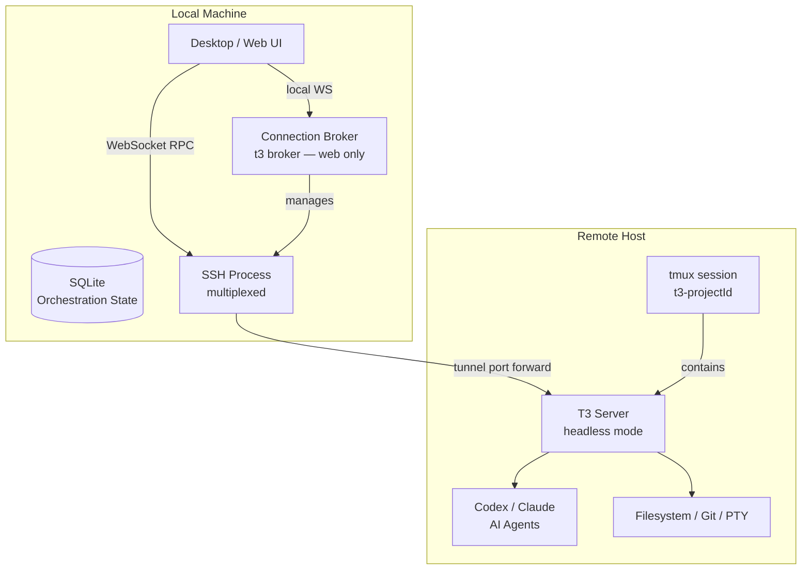

# Remote SSH Capability — Design Document

**Date:** 2026-04-10
**Status:** Draft

## Overview

T3 Code gains the ability to connect to remote machines over SSH. The T3 server runs on the remote host inside a persistent tmux session. The local client (Desktop or Web) manages the SSH lifecycle — provisioning, tunneling, health monitoring, and reconnection. AI agents (Codex/Claude) run remotely alongside the code.

**Mental model:** A remote project is just like a local project, except the server runs over there.

## Goals

- Full assisted-start experience: the local app SSHs in, installs the server, starts it, and connects — no manual setup
- Sub-second reconnect after laptop sleep/wake using SSH multiplexing
- Remote server survives SSH drops via bundled tmux
- Works in both Desktop (Electron) and Web (browser) clients
- Zero changes to the WebSocket RPC contract — the remote server speaks the same protocol

## Non-Goals (Phase 1)

- State synchronization between local and remote (future goal — see appendix)
- Remote file browsing before project creation (user provides the path)
- Multi-hop / bastion UI (works if the user's `~/.ssh/config` handles it)
- Windows remote targets (Linux and macOS only)
- Password or key-file SSH authentication (SSH agent only)

---

## Architecture

### Components



### Key Invariant

The WebSocket RPC contract between client and server is unchanged. The remote server speaks the exact same protocol as a local server. The only new machinery is the SSH lifecycle that gets traffic there.

### Local State, Remote Execution

All orchestration history (threads, messages, turns) lives in the local SQLite database. The remote server is stateless from a persistence perspective — it handles execution only (AI agents, terminal, git, filesystem). If the remote machine is wiped, no history is lost. On reconnect, the client replays events to resynchronize.

---

## Project Model

### Schema Changes

New types in `packages/contracts`:

```typescript
RemoteHost {
  host: TrimmedNonEmptyString       // hostname or SSH config alias
  user: TrimmedNonEmptyString       // SSH username
  port: PositiveInt                  // default 22
  label?: TrimmedString             // friendly display name, e.g. "devbox"
}
```

Extended project model:

```typescript
OrchestrationProject {
  ...existing fields
  remoteHost?: RemoteHost           // undefined = local project
  workspaceRoot: TrimmedNonEmptyString  // path on the execution machine
}
```

### Semantics

- `remoteHost` is set at project creation time via "Add Remote Project" flow.
- `workspaceRoot` always refers to a path on the execution machine — local filesystem for local projects, remote filesystem for remote projects.
- `remoteHost` is immutable after creation. To move a project to a different host, create a new project.
- Remote projects display a host indicator and connection status in the sidebar.

### Per-Project Isolation

Each remote project gets its own server process in its own tmux session. Multiple projects on the same host are fully isolated — independent crash domains, independent lifecycle. SSH connection multiplexing eliminates the overhead of multiple connections to the same host.

---

## Connection Lifecycle

### Phase 1 — Initiate SSH

The local app opens an SSH connection to `user@host` using the system's SSH agent for authentication.

- **Desktop (Electron):** Spawns an `ssh` subprocess directly.
- **Web (Browser):** Connects to the local connection broker (`t3 broker` at `ws://127.0.0.1:3774`), which manages SSH subprocesses on its behalf.

**Multiplexing awareness:** Before opening a new connection, check for an existing SSH control socket via `ssh -O check user@host`. If one exists (from a terminal session or another project on the same host), attach to it — sub-second, no auth needed. If not, establish a new master connection.

### Phase 2 — Provision Remote Environment

Run a bootstrap script over SSH to detect the remote environment and install if needed:

```bash
#!/bin/sh
set -e
T3_HOME="${HOME}/.t3"
mkdir -p "${T3_HOME}/bin" "${T3_HOME}/run" "${T3_HOME}/logs"
CURRENT_VERSION=""
if [ -x "${T3_HOME}/bin/t3" ]; then
  CURRENT_VERSION=$("${T3_HOME}/bin/t3" --version 2>/dev/null || echo "")
fi
echo "OS:$(uname -s) ARCH:$(uname -m) VERSION:${CURRENT_VERSION}"
```

If the version is missing or doesn't match the local client's version, transfer the correct binaries:

- `t3-server-{os}-{arch}` → `~/.t3/bin/t3`
- `tmux-{os}-{arch}` → `~/.t3/bin/tmux`

**Version policy:** Strict match. The remote server version must exactly match the local client version. Upgrades and downgrades happen automatically on every connection if there's a mismatch.

### Phase 3 — Start Remote Server

Check if a tmux session already exists for this project:

```bash
~/.t3/bin/tmux has-session -t t3-<projectId> 2>/dev/null
```

**If the session exists (reconnect fast path):**

1. Read `~/.t3/run/<projectId>/server.json` for the port
2. Write fresh auth token to `~/.t3/run/<projectId>/auth-token`
3. Write current `SSH_AUTH_SOCK` to `~/.t3/run/<projectId>/env`
4. Skip to Phase 4

**If the session does not exist (cold start):**

```bash
~/.t3/bin/tmux new-session -d -s t3-<projectId> \
  '~/.t3/bin/t3 serve --mode headless --host 127.0.0.1 --port 0 \
   --auth-token-file ~/.t3/run/<projectId>/auth-token \
   --state-file ~/.t3/run/<projectId>/server.json \
   --log-file ~/.t3/run/<projectId>/logs/server.log \
   --cwd <workspaceRoot>'
```

The server writes its randomly-assigned port to the state file on startup.

### Phase 4 — Establish Tunnel

Set up an SSH local port forward:

```
ssh -O forward -L <localPort>:127.0.0.1:<remotePort> user@host
```

If using a multiplexed connection, this attaches to the existing master. If not, uses the connection established in Phase 1.

### Phase 5 — Connect Client

The local UI connects its WebSocket RPC client to `ws://127.0.0.1:<localPort>` with the auth token. From this point, behavior is identical to a local server connection.

### Teardown

- **Project close:** SSH tunnel is removed (`ssh -O cancel`). Tmux session keeps running — the server persists for fast reconnect.
- **Project delete:** Kill tmux session (`tmux kill-session -t t3-<projectId>`), remove `~/.t3/run/<projectId>/`, remove SSH tunnel.
- **App quit:** SSH tunnels are closed. Tmux sessions persist on the remote for the configured ControlPersist duration (or indefinitely if no timeout).

---

## Connection Broker (Web Support)

Since browsers cannot spawn SSH processes, a lightweight local intermediary handles SSH on their behalf.

### What It Is

A mode of the existing `t3` CLI invoked as `t3 broker`. It runs on the user's local machine, exposes a local-only WebSocket at `ws://127.0.0.1:3774`, and manages SSH subprocesses.

### Broker RPC Methods

- `broker.connect({ host, user, port, projectId })` — Runs phases 1-4, returns `{ wsUrl, authToken }`
- `broker.disconnect({ projectId })` — Tears down tunnel for a project
- `broker.status()` — Returns active connections and health
- `broker.cleanup({ host })` — Lists and removes stale sessions

### Data Path

The broker is not in the data path. It only orchestrates connection setup and teardown. All RPC traffic flows directly from the web app to the remote server through the SSH tunnel. Zero performance overhead during normal use.

### Desktop

The Desktop app skips the broker entirely. Electron spawns and manages SSH processes directly in the main process — same logic, just inline rather than behind a WebSocket hop.

---

## SSH Session Resilience

### Multiplexing Awareness

T3 Code checks for an existing SSH control socket before opening new connections. If one exists (from any SSH session to that host), it attaches — providing instant connection with no auth round-trip. If none exists, T3 establishes its own master connection.

This means:

- If the user has an active terminal session to the host, T3 attaches in milliseconds.
- If not, T3 creates the master and subsequent operations on that host are fast.
- The user's `ControlPersist` setting (e.g., 4 hours) determines how long the master stays alive after all sessions detach.

### Eager Warm-Up

On app launch, T3 Code pre-warms SSH connections for remote hosts used in the last 3 days (configurable). This happens in the background. By the time the user clicks into a remote project, the control socket is already warm.

Hosts not used recently are connected lazily on first project open.

### Connection States

| State          | Meaning                              | UI                                    |
| -------------- | ------------------------------------ | ------------------------------------- |
| `disconnected` | No SSH connection                    | Grey indicator, "Connect" action      |
| `provisioning` | SSH open, checking/installing binary | Spinner, "Setting up remote..."       |
| `starting`     | Remote server launching in tmux      | Spinner, "Starting server..."         |
| `connected`    | Tunnel active, WebSocket healthy     | Green indicator                       |
| `reconnecting` | Connection lost, auto-recovering     | Yellow indicator, "Reconnecting..."   |
| `error`        | Unrecoverable failure                | Red indicator, error message, "Retry" |

### Auto-Reconnect

When a connection drops:

1. Client detects WebSocket close
2. Attempts to re-establish SSH (may create new master or attach to existing)
3. Checks if tmux session is alive (`tmux has-session`)
4. If alive: read port, write fresh auth token + `SSH_AUTH_SOCK`, tunnel, reconnect WebSocket
5. If dead: full cold start (provision check, start server, tunnel)
6. After WebSocket reconnects: `replayEvents(fromLastSequence)` catches up on missed events

**Retry policy:** Exponential backoff — 1s, 2s, 4s, 8s, max 30s. After 5 minutes of continuous failure, move to `error` state. User can manually retry.

**Laptop sleep/wake:** On wake, immediately attempt reconnect. The SSH process may have died, but the tmux session on the remote is still running. Fresh SSH + tunnel + WebSocket = fast recovery.

### In-Flight Work During Disconnects

Behavior depends on the project's runtime mode:

- **`full-access` mode:** The remote server continues the AI turn to completion. The agent is trusted — work proceeds unsupervised. On reconnect, events replay to show what happened.
- **`approval-required` mode:** The remote server pauses the AI turn on client disconnect. The agent waits. On reconnect, the turn resumes with user oversight intact.

---

## Bundled tmux

### Rationale

Without tmux, the remote server process is tied to the SSH session's lifetime. SSH dies, the server dies, provider sessions are killed, and the AI agent loses all in-memory context. Reconnect means full restart.

With tmux, the server persists through SSH drops. Reconnect just means establishing a new tunnel to the same port.

### Approach

We bundle a statically-linked tmux binary alongside the T3 server binary. No system package manager, no sudo, no dependency on what's installed on the remote.

```
~/.t3/bin/t3          # T3 server binary
~/.t3/bin/tmux        # statically-linked tmux (~1-2MB)
```

The tmux binary is part of the same provisioning flow as the server binary — transferred via SCP on first connection or version mismatch.

### Remote Directory Layout

```
~/.t3/
  bin/
    t3                              # server binary
    tmux                            # bundled tmux
  run/
    <projectId>/
      server.json                   # port, PID
      auth-token                    # current auth token
      env                           # SSH_AUTH_SOCK and other env
      logs/
        server.log                  # rotating log files
```

---

## Terminal Forwarding

The remote server manages PTY sessions, but the terminal emulator is xterm.js in the browser. The remote server overrides `TERM=xterm-256color` when spawning PTY sessions, regardless of the SSH session's `TERM` value.

This prevents escape sequence mismatches when the user's SSH config sets a different `TERM` (e.g., `xterm-ghostty`). The SSH session's `TERM` applies to direct SSH use; T3's terminal sessions get the correct value for xterm.js.

---

## SSH Agent Forwarding and Git Authentication

When the user's SSH config includes `ForwardAgent yes`, the `SSH_AUTH_SOCK` is available on the remote. This enables git push/pull operations by AI agents using the user's local SSH keys.

### Propagation

The T3 server explicitly propagates `SSH_AUTH_SOCK` into provider subprocess environments rather than relying on implicit inheritance.

### tmux Socket Staleness

When the SSH session that created the tmux session dies and a new one connects, the `SSH_AUTH_SOCK` path changes. The old socket path inside tmux is stale.

**Fix:** On reconnect, the local app writes the current `SSH_AUTH_SOCK` value to `~/.t3/run/<projectId>/env`. The T3 server watches this file and updates its subprocess environment. Long-lived tmux sessions always have a fresh agent socket.

### Trust Implications

In `full-access` mode with agent forwarding enabled, the AI agent has unsupervised access to the forwarded SSH agent. This is consistent with the existing trust model — `full-access` means full access.

---

## Observability

### Level 1 — Remote Logs (always available)

The remote server writes rotating logs to `~/.t3/run/<projectId>/logs/`. On connection errors, the local app fetches the last 50 lines over SSH and displays them in the error UI.

Log rotation: 3 files, 10MB max each, using the existing `RotatingFileSink` from `packages/shared`.

### Level 2 — Log Streaming (built-in)

New RPC method: `server.subscribeLogStream`. The web app can display a "Remote Server Logs" panel for live debugging. Reuses existing streaming infrastructure.

### Level 3 — OTLP Export (opt-in)

The remote server exports traces and metrics via OTLP using the existing `T3CODE_OTLP_*` environment variables. These are passed through when starting the remote server. The remote exports directly to the collector — OTLP traffic does not flow through the SSH tunnel.

---

## Cleanup

### Stale Session Detection

On connect, the local app lists tmux sessions and `~/.t3/run/*/` directories on the remote. It compares against known projects and offers to clean up orphans.

### Project Deletion

When a remote project is deleted:

1. If the host is reachable: kill tmux session, remove `~/.t3/run/<projectId>/`
2. If unreachable: skip, clean up on next connection to that host

### Full Uninstall

`t3 remote uninstall <host>` (or a button in settings) SSHs in, kills all tmux sessions, and removes `~/.t3/`.

### Disk Footprint

- `~/.t3/bin/` — ~50-80MB (server + tmux binaries)
- `~/.t3/run/<projectId>/` — a few MB per active project (state files + logs)
- Total per host: negligible on any dev machine

---

## Security Model

### Principles

All traffic flows through the SSH tunnel. The remote T3 server binds to `127.0.0.1` only — never exposed to the network. We inherit SSH's security model entirely and add an application-layer auth token on top.

### SSH Authentication

SSH agent only. T3 Code never sees, stores, or handles private keys. If `ssh user@host` works in the user's terminal, it works in T3.

Host key verification uses the system's `~/.ssh/known_hosts`. Unknown hosts trigger the standard SSH prompt, surfaced in the UI.

### Application Auth Token

- Generated fresh per connection
- Written to `~/.t3/run/<projectId>/auth-token` on the remote (readable only by the user)
- Server reads the file on each WebSocket handshake
- Rotated on every reconnect

### What We Don't Do

- No password authentication
- No credential storage (nothing in database, settings, or config)
- No SSH key generation or management
- No custom tunnel encryption (SSH handles it)
- No remote server network exposure (always `127.0.0.1`, always behind SSH)

---

## Error Handling

Every failure is surfaced with actionable context. No silent failures.

| Failure                            | Message                                                                             |
| ---------------------------------- | ----------------------------------------------------------------------------------- |
| SSH auth fails                     | "Could not authenticate to [host]. Ensure your SSH agent has the right key loaded." |
| Host unreachable                   | "Could not reach [host]. Check your network connection."                            |
| Unsupported OS/arch                | "Remote architecture [arch] is not supported."                                      |
| Binary transfer fails              | "Could not install T3 server on [host]. Check disk space and permissions."          |
| Server fails to start              | Shows remote stderr. Common: port conflicts, missing libs.                          |
| Tunnel setup fails                 | "Could not establish port forward to [host]."                                       |
| tmux not startable                 | "Could not start tmux session on [host]."                                           |
| Version mismatch (during transfer) | Automatic — upgrades/downgrades silently.                                           |

---

## Implementation Scope

### New/Modified Packages

1. **`packages/contracts`** — `RemoteHost` schema, extended project model, connection state types, broker RPC contract, `server.subscribeLogStream` RPC method

2. **`packages/shared`** — New `ssh/` subpath export: SSH subprocess management, remote provisioning logic, connection state machine

3. **`apps/server`** — `serve` CLI mode (headless, no UI serving, stdout port advertisement, auth-token-file, state-file). Updated project commands for `remoteHost`. `SSH_AUTH_SOCK` propagation. `TERM` override for PTY. Disconnect-aware pause behavior per runtime mode.

4. **`apps/desktop`** — SSH lifecycle in Electron main process. New IPC channels: `desktop:ssh-connect`, `desktop:ssh-disconnect`, `desktop:ssh-status`. Eager warm-up on launch.

5. **`apps/web`** — Broker client. "Add Remote Project" UI. Connection status indicators. Reconnect handling. Remote log viewer panel.

6. **`t3 broker`** — New CLI mode for web support. Local-only WebSocket, SSH subprocess management, returns tunnel URLs.

7. **CI/Release** — Produce `t3-server-{os}-{arch}` standalone binaries. Produce `tmux-{os}-{arch}` static binaries. Bundle both in release artifacts.

---

## Appendix: Future — State Synchronization

Phase 1 uses local state with remote execution. A future evolution could synchronize orchestration state between local and remote, enabling:

- Multiple local machines connecting to the same remote project with shared history
- Remote-side persistence surviving local machine loss
- Offline-capable remote work that syncs when reconnected

This would require a conflict resolution strategy for the event store (likely last-writer-wins with vector clocks or a CRDT-based approach). The event-sourced architecture is well-suited to this — events are append-only and naturally mergeable — but the implementation complexity is significant. Deferred to a future phase.
