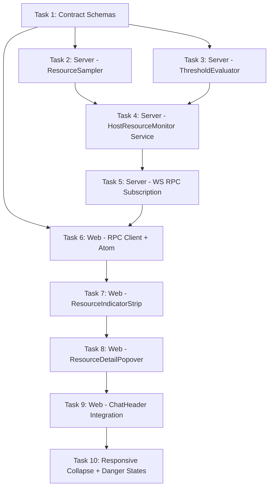

# Host Resource Monitor Implementation Plan

> **For Claude:** REQUIRED SUB-SKILL: Use superpowers:executing-plans to implement this plan task-by-task.

**Goal:** Add a real-time host resource monitoring system that samples CPU, RAM, disk, Docker containers, kubecontext, and remote/SSH state on the server and pushes threshold-crossing snapshots to the web UI via a streaming WS RPC subscription, displayed as a pill cluster in the ChatHeader with a vertical accordion detail popover.

**Architecture:** The server gains a `HostResourceMonitor` Effect service that runs a ~5s sample loop internally but only pushes `HostResourceSnapshot` events over a streaming RPC when metric state transitions occur (normal→warn→critical and back, with 5% hysteresis). CPU uses a configurable sliding window for sustained detection. The web consumes this via an Effect Atom backed by a WS subscription, rendering as a pill cluster of Lucide icons in the ChatHeader that opens a single vertical accordion popover on hover/click showing all metrics.

**Tech Stack:** Effect-TS (Service/Layer pattern, Stream, PubSub, Ref, Schedule), Effect Schema, Vitest, React 19, @base-ui/react (Popover), Tailwind CSS, Lucide icons, @effect/atom-react

---

## Design Decisions (from prior session)

| Decision           | Choice                                             |
| ------------------ | -------------------------------------------------- |
| Header treatment   | **Option C** — pill cluster of icons               |
| Detail popover     | **Option 1** — vertical accordion                  |
| Popover trigger    | **Option 1** — whole pill triggers one popover     |
| Push strategy      | Threshold-crossing transitions only (not periodic) |
| CPU detection      | Sustained sliding window (default 5s)              |
| Hysteresis         | 5% inside boundary to prevent toggling             |
| First subscription | Immediate full snapshot, then deltas               |

## Dependency Graph



---

## Task 1: Contract Schemas

Define all shared types in the contracts package. This is the foundation — server and web both import from here.

**Files:**

- Create: `packages/contracts/src/hostResource.ts`
- Modify: `packages/contracts/src/rpc.ts`
- Modify: `packages/contracts/src/index.ts`
- Test: `packages/contracts/src/hostResource.test.ts`

### Step 1: Write the failing test for schema encoding/decoding

```typescript
// packages/contracts/src/hostResource.test.ts
import { describe, expect, it } from "vitest";
import * as Schema from "effect/Schema";
import {
  HostResourceSnapshot,
  HostResourceStreamEvent,
  MetricState,
  ResourceMetricKind,
} from "./hostResource";

describe("HostResource schemas", () => {
  describe("MetricState", () => {
    it("accepts valid states", () => {
      expect(Schema.decodeUnknownSync(MetricState)("normal")).toBe("normal");
      expect(Schema.decodeUnknownSync(MetricState)("warn")).toBe("warn");
      expect(Schema.decodeUnknownSync(MetricState)("critical")).toBe("critical");
    });

    it("rejects invalid states", () => {
      expect(() => Schema.decodeUnknownSync(MetricState)("unknown")).toThrow();
    });
  });

  describe("ResourceMetricKind", () => {
    it("accepts all metric kinds", () => {
      for (const kind of ["ram", "cpu", "disk", "containers", "kubecontext", "remote"]) {
        expect(Schema.decodeUnknownSync(ResourceMetricKind)(kind)).toBe(kind);
      }
    });
  });

  describe("HostResourceSnapshot", () => {
    it("round-trips a full snapshot", () => {
      const snapshot = {
        ram: {
          state: "normal",
          usagePercent: 72,
          totalBytes: 34359738368,
          usedBytes: 24739011584,
          availableBytes: 9620726784,
          swapUsedBytes: 2147483648,
          swapTotalBytes: 8589934592,
        },
        cpu: {
          state: "normal",
          usagePercent: 12,
          coreCount: 10,
          sustainedPercent: 11,
        },
        disk: {
          state: "normal",
          usagePercent: 45,
          totalBytes: 1000000000000,
          usedBytes: 450000000000,
          availableBytes: 550000000000,
          mountPath: "/",
        },
        containers: null,
        kubecontext: null,
        remote: {
          isRemote: false,
          hostname: "macbook.local",
          fqdn: "macbook.local",
          isRoot: false,
        },
      };
      const encoded = Schema.encodeSync(HostResourceSnapshot)(
        Schema.decodeUnknownSync(HostResourceSnapshot)(snapshot),
      );
      expect(encoded.ram.state).toBe("normal");
      expect(encoded.cpu.usagePercent).toBe(12);
    });
  });

  describe("HostResourceStreamEvent", () => {
    it("decodes a snapshot event", () => {
      const event = {
        version: 1,
        type: "snapshot",
        data: {
          ram: {
            state: "normal",
            usagePercent: 72,
            totalBytes: 34359738368,
            usedBytes: 24739011584,
            availableBytes: 9620726784,
            swapUsedBytes: 0,
            swapTotalBytes: 0,
          },
          cpu: { state: "normal", usagePercent: 12, coreCount: 10, sustainedPercent: 11 },
          disk: {
            state: "normal",
            usagePercent: 45,
            totalBytes: 1e12,
            usedBytes: 4.5e11,
            availableBytes: 5.5e11,
            mountPath: "/",
          },
          containers: null,
          kubecontext: null,
          remote: { isRemote: false, hostname: "mac.local", fqdn: "mac.local", isRoot: false },
        },
      };
      const decoded = Schema.decodeUnknownSync(HostResourceStreamEvent)(event);
      expect(decoded.type).toBe("snapshot");
    });

    it("decodes a transition event", () => {
      const event = {
        version: 1,
        type: "transition",
        metric: "ram",
        previousState: "normal",
        currentState: "warn",
        data: {
          ram: {
            state: "warn",
            usagePercent: 82,
            totalBytes: 34359738368,
            usedBytes: 28174745763,
            availableBytes: 6184992605,
            swapUsedBytes: 0,
            swapTotalBytes: 0,
          },
          cpu: { state: "normal", usagePercent: 12, coreCount: 10, sustainedPercent: 11 },
          disk: {
            state: "normal",
            usagePercent: 45,
            totalBytes: 1e12,
            usedBytes: 4.5e11,
            availableBytes: 5.5e11,
            mountPath: "/",
          },
          containers: null,
          kubecontext: null,
          remote: { isRemote: false, hostname: "mac.local", fqdn: "mac.local", isRoot: false },
        },
      };
      const decoded = Schema.decodeUnknownSync(HostResourceStreamEvent)(event);
      expect(decoded.type).toBe("transition");
    });
  });
});
```

### Step 2: Run test to verify it fails

```bash
cd /Volumes/Code/t3code && bun run --cwd packages/contracts vitest run src/hostResource.test.ts
```

Expected: FAIL — `hostResource` module does not exist.

### Step 3: Write the schemas

```typescript
// packages/contracts/src/hostResource.ts
import * as Schema from "effect/Schema";
import { ProjectId } from "./baseSchemas";

// ── Metric State Machine ────────────────────────────────────────

export const MetricState = Schema.Literals(["normal", "warn", "critical"]);
export type MetricState = typeof MetricState.Type;

export const ResourceMetricKind = Schema.Literals([
  "ram",
  "cpu",
  "disk",
  "containers",
  "kubecontext",
  "remote",
]);
export type ResourceMetricKind = typeof ResourceMetricKind.Type;

// ── Per-Metric Detail Schemas ───────────────────────────────────

export const RamMetric = Schema.Struct({
  state: MetricState,
  usagePercent: Schema.Number,
  totalBytes: Schema.Number,
  usedBytes: Schema.Number,
  availableBytes: Schema.Number,
  swapUsedBytes: Schema.Number,
  swapTotalBytes: Schema.Number,
});
export type RamMetric = typeof RamMetric.Type;

export const CpuMetric = Schema.Struct({
  state: MetricState,
  usagePercent: Schema.Number,
  coreCount: Schema.Number,
  sustainedPercent: Schema.Number,
});
export type CpuMetric = typeof CpuMetric.Type;

export const DiskMetric = Schema.Struct({
  state: MetricState,
  usagePercent: Schema.Number,
  totalBytes: Schema.Number,
  usedBytes: Schema.Number,
  availableBytes: Schema.Number,
  mountPath: Schema.String,
});
export type DiskMetric = typeof DiskMetric.Type;

export const ContainersMetric = Schema.Struct({
  state: MetricState,
  running: Schema.Number,
  stopped: Schema.Number,
  total: Schema.Number,
});
export type ContainersMetric = typeof ContainersMetric.Type;

export const KubecontextMetric = Schema.Struct({
  state: MetricState,
  context: Schema.String,
  cluster: Schema.String,
  namespace: Schema.String,
  isDanger: Schema.Boolean,
  dangerReason: Schema.NullOr(Schema.String),
});
export type KubecontextMetric = typeof KubecontextMetric.Type;

export const RemoteMetric = Schema.Struct({
  isRemote: Schema.Boolean,
  hostname: Schema.String,
  fqdn: Schema.String,
  isRoot: Schema.Boolean,
});
export type RemoteMetric = typeof RemoteMetric.Type;

// ── Full Snapshot ───────────────────────────────────────────────

export const HostResourceSnapshot = Schema.Struct({
  ram: RamMetric,
  cpu: CpuMetric,
  disk: DiskMetric,
  containers: Schema.NullOr(ContainersMetric),
  kubecontext: Schema.NullOr(KubecontextMetric),
  remote: RemoteMetric,
});
export type HostResourceSnapshot = typeof HostResourceSnapshot.Type;

// ── Stream Events ───────────────────────────────────────────────

export const HostResourceStreamSnapshotEvent = Schema.Struct({
  version: Schema.Literal(1),
  type: Schema.Literal("snapshot"),
  data: HostResourceSnapshot,
});
export type HostResourceStreamSnapshotEvent = typeof HostResourceStreamSnapshotEvent.Type;

export const HostResourceStreamTransitionEvent = Schema.Struct({
  version: Schema.Literal(1),
  type: Schema.Literal("transition"),
  metric: ResourceMetricKind,
  previousState: MetricState,
  currentState: MetricState,
  data: HostResourceSnapshot,
});
export type HostResourceStreamTransitionEvent = typeof HostResourceStreamTransitionEvent.Type;

export const HostResourceStreamEvent = Schema.Union([
  HostResourceStreamSnapshotEvent,
  HostResourceStreamTransitionEvent,
]);
export type HostResourceStreamEvent = typeof HostResourceStreamEvent.Type;

// ── Subscription Input ──────────────────────────────────────────

export const HostResourceSubscribeInput = Schema.Struct({
  projectId: ProjectId,
});
export type HostResourceSubscribeInput = typeof HostResourceSubscribeInput.Type;

// ── Threshold Configuration ─────────────────────────────────────

export const ResourceThresholds = Schema.Struct({
  ram: Schema.Struct({
    warnPercent: Schema.Number,
    criticalPercent: Schema.Number,
  }),
  cpu: Schema.Struct({
    warnPercent: Schema.Number,
    criticalPercent: Schema.Number,
    sustainedSeconds: Schema.Number,
  }),
  disk: Schema.Struct({
    warnPercent: Schema.Number,
    criticalPercent: Schema.Number,
  }),
});
export type ResourceThresholds = typeof ResourceThresholds.Type;

export const DEFAULT_RESOURCE_THRESHOLDS: ResourceThresholds = {
  ram: { warnPercent: 80, criticalPercent: 92 },
  cpu: { warnPercent: 85, criticalPercent: 95, sustainedSeconds: 5 },
  disk: { warnPercent: 85, criticalPercent: 95 },
};

// ── Danger Pattern Configuration ────────────────────────────────

export const KubeDangerPatterns = Schema.Struct({
  contextPatterns: Schema.Array(Schema.String),
});
export type KubeDangerPatterns = typeof KubeDangerPatterns.Type;

export const DEFAULT_KUBE_DANGER_PATTERNS: KubeDangerPatterns = {
  contextPatterns: ["pd-", "prod-", "production"],
};

// ── Error ───────────────────────────────────────────────────────

export class HostResourceMonitorError extends Schema.TaggedErrorClass<HostResourceMonitorError>()(
  "HostResourceMonitorError",
  {
    detail: Schema.String,
    cause: Schema.optional(Schema.Defect),
  },
) {
  override get message(): string {
    return `Host resource monitor error: ${this.detail}`;
  }
}
```

### Step 4: Run test to verify it passes

```bash
cd /Volumes/Code/t3code && bun run --cwd packages/contracts vitest run src/hostResource.test.ts
```

Expected: PASS — all schema tests green.

### Step 5: Add the RPC definition to `rpc.ts`

Add to `WS_METHODS`:

```typescript
// In packages/contracts/src/rpc.ts — add to WS_METHODS object:
subscribeHostResources: "subscribeHostResources",
```

Add the RPC definition after the existing subscription RPCs:

```typescript
// In packages/contracts/src/rpc.ts — add import at top:
import {
  HostResourceStreamEvent,
  HostResourceSubscribeInput,
  HostResourceMonitorError,
} from "./hostResource";

// Add RPC definition:
export const WsSubscribeHostResourcesRpc = Rpc.make(WS_METHODS.subscribeHostResources, {
  payload: HostResourceSubscribeInput,
  success: HostResourceStreamEvent,
  error: HostResourceMonitorError,
  stream: true,
});
```

Add `WsSubscribeHostResourcesRpc` to the `WsRpcGroup.make(...)` call.

### Step 6: Export from `index.ts`

Add to `packages/contracts/src/index.ts`:

```typescript
export * from "./hostResource";
```

### Step 7: Run all contract tests

```bash
cd /Volumes/Code/t3code && bun run --cwd packages/contracts vitest run
```

Expected: PASS — all existing tests still pass, new tests pass.

### Step 8: Commit

```bash
git add packages/contracts/src/hostResource.ts packages/contracts/src/hostResource.test.ts packages/contracts/src/rpc.ts packages/contracts/src/index.ts
git commit -m "feat(contracts): add HostResource schemas, stream events, and WS RPC definition"
```

---

## Task 2: Server — ResourceSampler

The raw metric collector. Runs on a schedule, returns plain numbers. No threshold logic — that's the evaluator's job.

**Files:**

- Create: `apps/server/src/hostResource/Services/ResourceSampler.ts`
- Create: `apps/server/src/hostResource/Layers/ResourceSampler.ts`
- Create: `apps/server/src/hostResource/Samplers/RamSampler.ts`
- Create: `apps/server/src/hostResource/Samplers/CpuSampler.ts`
- Create: `apps/server/src/hostResource/Samplers/DiskSampler.ts`
- Create: `apps/server/src/hostResource/Samplers/DockerSampler.ts`
- Create: `apps/server/src/hostResource/Samplers/KubecontextSampler.ts`
- Create: `apps/server/src/hostResource/Samplers/RemoteSampler.ts`
- Test: `apps/server/src/hostResource/__tests__/ResourceSampler.test.ts`

### Step 1: Write the failing test for the sampler service

```typescript
// apps/server/src/hostResource/__tests__/ResourceSampler.test.ts
import { describe, expect, it } from "vitest";
import { Effect, Layer } from "effect";
import { ResourceSampler } from "../Services/ResourceSampler";
import { ResourceSamplerLive } from "../Layers/ResourceSampler";

describe("ResourceSampler", () => {
  it("collects a raw sample with all metric fields", async () => {
    const program = Effect.gen(function* () {
      const sampler = yield* ResourceSampler;
      const sample = yield* sampler.collectSample("/tmp");
      return sample;
    });

    const result = await Effect.runPromise(program.pipe(Effect.provide(ResourceSamplerLive)));

    // RAM
    expect(result.ram.totalBytes).toBeGreaterThan(0);
    expect(result.ram.usedBytes).toBeGreaterThan(0);
    expect(result.ram.availableBytes).toBeGreaterThanOrEqual(0);
    expect(result.ram.usagePercent).toBeGreaterThan(0);
    expect(result.ram.usagePercent).toBeLessThanOrEqual(100);

    // CPU
    expect(result.cpu.usagePercent).toBeGreaterThanOrEqual(0);
    expect(result.cpu.usagePercent).toBeLessThanOrEqual(100);
    expect(result.cpu.coreCount).toBeGreaterThan(0);

    // Disk
    expect(result.disk.totalBytes).toBeGreaterThan(0);
    expect(result.disk.mountPath).toBeTruthy();

    // Remote — in test always local
    expect(result.remote.isRemote).toBe(false);
    expect(result.remote.hostname).toBeTruthy();

    // Containers + Kubecontext — nullable, just check shape
    if (result.containers !== null) {
      expect(result.containers.total).toBeGreaterThanOrEqual(0);
    }
    if (result.kubecontext !== null) {
      expect(result.kubecontext.context).toBeTruthy();
    }
  });
});
```

### Step 2: Run test to verify it fails

```bash
cd /Volumes/Code/t3code && bun run --cwd apps/server vitest run src/hostResource/__tests__/ResourceSampler.test.ts
```

Expected: FAIL — module does not exist.

### Step 3: Write the individual samplers

Each sampler is a plain module exporting an Effect that returns raw data. No Effect Service boilerplate — just functions.

**RamSampler.ts** — uses `os.freemem()`/`os.totalmem()`, with `/proc/meminfo` fallback for swap on Linux and `sysctl` on macOS.

**CpuSampler.ts** — uses `os.cpus()` to compute delta between two snapshots. On first call, returns 0. Stores previous snapshot in a `Ref<CpuTick[]>`.

**DiskSampler.ts** — shells out to `df -k <path>` and parses output. Returns total/used/available/mountPath.

**DockerSampler.ts** — attempts HTTP GET to Docker socket (`/var/run/docker.sock` or `$DOCKER_HOST`) at `/v1.43/containers/json?all=true`. Returns `null` if socket missing or connection refused.

**KubecontextSampler.ts** — reads `$KUBECONFIG` or `~/.kube/config`, parses YAML for `current-context`, resolves cluster/user/namespace. Returns `null` if no config file.

**RemoteSampler.ts** — checks `$SSH_CLIENT` / `$SSH_CONNECTION` env vars. Gets hostname from `os.hostname()`, fqdn from `hostname -f` shell-out. Checks `process.getuid?.() === 0` for root detection.

**Implementation notes:**

- All samplers return `Effect.Effect<T, never, never>` — they never fail, they degrade (return null or defaults)
- Docker and Kubecontext samplers catch all errors internally and return null
- Disk sampler falls back to root `/` if the path-specific df fails

### Step 4: Write the ResourceSampler service interface and layer

```typescript
// apps/server/src/hostResource/Services/ResourceSampler.ts
import { Context, Effect } from "effect";

export interface RawSample {
  readonly ram: {
    readonly totalBytes: number;
    readonly usedBytes: number;
    readonly availableBytes: number;
    readonly usagePercent: number;
    readonly swapUsedBytes: number;
    readonly swapTotalBytes: number;
  };
  readonly cpu: {
    readonly usagePercent: number;
    readonly coreCount: number;
  };
  readonly disk: {
    readonly totalBytes: number;
    readonly usedBytes: number;
    readonly availableBytes: number;
    readonly usagePercent: number;
    readonly mountPath: string;
  };
  readonly containers: {
    readonly running: number;
    readonly stopped: number;
    readonly total: number;
  } | null;
  readonly kubecontext: {
    readonly context: string;
    readonly cluster: string;
    readonly namespace: string;
  } | null;
  readonly remote: {
    readonly isRemote: boolean;
    readonly hostname: string;
    readonly fqdn: string;
    readonly isRoot: boolean;
  };
}

export interface ResourceSamplerShape {
  /** Collect a single raw sample. `workspacePath` is used for disk metrics. */
  readonly collectSample: (workspacePath: string) => Effect.Effect<RawSample>;
}

export class ResourceSampler extends Context.Tag("ResourceSampler")<
  ResourceSampler,
  ResourceSamplerShape
>() {}
```

```typescript
// apps/server/src/hostResource/Layers/ResourceSampler.ts
import { Effect, Layer, Ref } from "effect";
import { ResourceSampler, type RawSample } from "../Services/ResourceSampler";
import { sampleRam } from "../Samplers/RamSampler";
import { makeCpuSampler } from "../Samplers/CpuSampler";
import { sampleDisk } from "../Samplers/DiskSampler";
import { sampleDocker } from "../Samplers/DockerSampler";
import { sampleKubecontext } from "../Samplers/KubecontextSampler";
import { sampleRemote } from "../Samplers/RemoteSampler";

export const ResourceSamplerLive = Layer.effect(
  ResourceSampler,
  Effect.gen(function* () {
    const cpuSampler = yield* makeCpuSampler();

    return {
      collectSample: (workspacePath: string) =>
        Effect.all({
          ram: sampleRam,
          cpu: cpuSampler.sample,
          disk: sampleDisk(workspacePath),
          containers: sampleDocker,
          kubecontext: sampleKubecontext,
          remote: sampleRemote,
        }),
    };
  }),
);
```

### Step 5: Run test to verify it passes

```bash
cd /Volumes/Code/t3code && bun run --cwd apps/server vitest run src/hostResource/__tests__/ResourceSampler.test.ts
```

Expected: PASS.

### Step 6: Commit

```bash
git add apps/server/src/hostResource/
git commit -m "feat(server): add ResourceSampler service with RAM, CPU, disk, Docker, kubeconfig, and remote samplers"
```

---

## Task 3: Server — ThresholdEvaluator

The state machine that compares raw samples against thresholds and tracks transitions. Pure logic — no side effects, highly testable.

**Files:**

- Create: `apps/server/src/hostResource/Services/ThresholdEvaluator.ts`
- Create: `apps/server/src/hostResource/Layers/ThresholdEvaluator.ts`
- Test: `apps/server/src/hostResource/__tests__/ThresholdEvaluator.test.ts`

### Step 1: Write failing tests for the evaluator

```typescript
// apps/server/src/hostResource/__tests__/ThresholdEvaluator.test.ts
import { describe, expect, it } from "vitest";
import { Effect } from "effect";
import { evaluateThresholds, type EvaluatorState } from "../Layers/ThresholdEvaluator";
import { DEFAULT_RESOURCE_THRESHOLDS, DEFAULT_KUBE_DANGER_PATTERNS } from "@t3tools/contracts";
import type { RawSample } from "../Services/ResourceSampler";

const makeSample = (
  overrides: Partial<{
    ramPercent: number;
    cpuPercent: number;
    diskPercent: number;
    containerCount: number | null;
    kubecontext: string | null;
    isRoot: boolean;
  }>,
): RawSample => ({
  ram: {
    totalBytes: 32e9,
    usedBytes: 32e9 * ((overrides.ramPercent ?? 50) / 100),
    availableBytes: 32e9 * (1 - (overrides.ramPercent ?? 50) / 100),
    usagePercent: overrides.ramPercent ?? 50,
    swapUsedBytes: 0,
    swapTotalBytes: 0,
  },
  cpu: {
    usagePercent: overrides.cpuPercent ?? 10,
    coreCount: 10,
  },
  disk: {
    totalBytes: 1e12,
    usedBytes: 1e12 * ((overrides.diskPercent ?? 30) / 100),
    availableBytes: 1e12 * (1 - (overrides.diskPercent ?? 30) / 100),
    usagePercent: overrides.diskPercent ?? 30,
    mountPath: "/",
  },
  containers:
    overrides.containerCount != null
      ? { running: overrides.containerCount, stopped: 0, total: overrides.containerCount }
      : null,
  kubecontext:
    overrides.kubecontext != null
      ? { context: overrides.kubecontext, cluster: "test-cluster", namespace: "default" }
      : null,
  remote: {
    isRemote: false,
    hostname: "test",
    fqdn: "test.local",
    isRoot: overrides.isRoot ?? false,
  },
});

describe("ThresholdEvaluator", () => {
  const thresholds = DEFAULT_RESOURCE_THRESHOLDS;
  const dangerPatterns = DEFAULT_KUBE_DANGER_PATTERNS;

  describe("RAM threshold transitions", () => {
    it("returns normal when below warn threshold", () => {
      const result = evaluateThresholds(
        makeSample({ ramPercent: 70 }),
        makeInitialState(),
        thresholds,
        dangerPatterns,
      );
      expect(result.snapshot.ram.state).toBe("normal");
      expect(result.transitions).toHaveLength(0);
    });

    it("transitions to warn when crossing warn threshold", () => {
      const result = evaluateThresholds(
        makeSample({ ramPercent: 82 }),
        makeInitialState(),
        thresholds,
        dangerPatterns,
      );
      expect(result.snapshot.ram.state).toBe("warn");
      expect(result.transitions).toContainEqual({
        metric: "ram",
        previousState: "normal",
        currentState: "warn",
      });
    });

    it("transitions to critical when crossing critical threshold", () => {
      const state = makeInitialState();
      state.ram = "warn";
      const result = evaluateThresholds(
        makeSample({ ramPercent: 94 }),
        state,
        thresholds,
        dangerPatterns,
      );
      expect(result.snapshot.ram.state).toBe("critical");
      expect(result.transitions).toContainEqual({
        metric: "ram",
        previousState: "warn",
        currentState: "critical",
      });
    });

    it("uses hysteresis — stays in warn until 5% below threshold", () => {
      const state = makeInitialState();
      state.ram = "warn";
      // 76% is above 75% (80% - 5% hysteresis), so stays warn
      const result = evaluateThresholds(
        makeSample({ ramPercent: 76 }),
        state,
        thresholds,
        dangerPatterns,
      );
      expect(result.snapshot.ram.state).toBe("warn");
      expect(result.transitions).toHaveLength(0);
    });

    it("drops back to normal when below hysteresis band", () => {
      const state = makeInitialState();
      state.ram = "warn";
      // 74% is below 75% (80% - 5% hysteresis), so drops to normal
      const result = evaluateThresholds(
        makeSample({ ramPercent: 74 }),
        state,
        thresholds,
        dangerPatterns,
      );
      expect(result.snapshot.ram.state).toBe("normal");
      expect(result.transitions).toContainEqual({
        metric: "ram",
        previousState: "warn",
        currentState: "normal",
      });
    });
  });

  describe("kubecontext danger detection", () => {
    it("marks danger when context matches a danger pattern", () => {
      const result = evaluateThresholds(
        makeSample({ kubecontext: "pd-eastus-core" }),
        makeInitialState(),
        thresholds,
        dangerPatterns,
      );
      expect(result.snapshot.kubecontext?.isDanger).toBe(true);
      expect(result.snapshot.kubecontext?.state).toBe("critical");
    });

    it("marks safe when context does not match", () => {
      const result = evaluateThresholds(
        makeSample({ kubecontext: "dv-eastus-core" }),
        makeInitialState(),
        thresholds,
        dangerPatterns,
      );
      expect(result.snapshot.kubecontext?.isDanger).toBe(false);
      expect(result.snapshot.kubecontext?.state).toBe("normal");
    });
  });

  describe("container count change detection", () => {
    it("emits transition when container count changes", () => {
      const state = makeInitialState();
      state.lastContainerCount = 3;
      const result = evaluateThresholds(
        makeSample({ containerCount: 5 }),
        state,
        thresholds,
        dangerPatterns,
      );
      expect(result.transitions).toContainEqual(expect.objectContaining({ metric: "containers" }));
    });
  });

  describe("root session detection", () => {
    it("emits danger state for root user", () => {
      const result = evaluateThresholds(
        makeSample({ isRoot: true }),
        makeInitialState(),
        thresholds,
        dangerPatterns,
      );
      expect(result.transitions).toContainEqual(
        expect.objectContaining({ metric: "remote", currentState: "critical" }),
      );
    });
  });
});

function makeInitialState(): EvaluatorState {
  return {
    ram: "normal",
    cpu: "normal",
    disk: "normal",
    containers: "normal",
    kubecontext: "normal",
    remote: "normal",
    lastContainerCount: null,
    lastKubecontext: null,
    lastIsRemote: false,
    lastIsRoot: false,
    cpuSamples: [],
  };
}
```

### Step 2: Run test to verify it fails

```bash
cd /Volumes/Code/t3code && bun run --cwd apps/server vitest run src/hostResource/__tests__/ThresholdEvaluator.test.ts
```

Expected: FAIL.

### Step 3: Implement the evaluator

The evaluator is a **pure function** — `evaluateThresholds(sample, state, thresholds, dangerPatterns) => { snapshot, transitions, nextState }`.

Key logic:

- For RAM/disk: compare `usagePercent` against thresholds, apply hysteresis on downward transitions (threshold - 5%)
- For CPU: append to `cpuSamples[]` sliding window, compute average over `sustainedSeconds`, apply threshold to the average
- For containers: compare count against previous `lastContainerCount`
- For kubecontext: test `context` against each pattern in `contextPatterns` (substring match), and detect context/namespace changes
- For remote: check `isRoot` and `isRemote` changes
- Returns the full `HostResourceSnapshot` with computed states, plus an array of `Transition` objects

The Service/Layer wrappers are thin — the Layer just holds a `Ref<EvaluatorState>` and calls the pure function.

### Step 4: Run test to verify it passes

```bash
cd /Volumes/Code/t3code && bun run --cwd apps/server vitest run src/hostResource/__tests__/ThresholdEvaluator.test.ts
```

Expected: PASS.

### Step 5: Commit

```bash
git add apps/server/src/hostResource/Services/ThresholdEvaluator.ts apps/server/src/hostResource/Layers/ThresholdEvaluator.ts apps/server/src/hostResource/__tests__/ThresholdEvaluator.test.ts
git commit -m "feat(server): add ThresholdEvaluator with state machine, hysteresis, CPU sustained window, and danger detection"
```

---

## Task 4: Server — HostResourceMonitor Service

Combines the sampler and evaluator into the main service. Runs the ~5s loop, emits events via PubSub on transitions.

**Files:**

- Create: `apps/server/src/hostResource/Services/HostResourceMonitor.ts`
- Create: `apps/server/src/hostResource/Layers/HostResourceMonitor.ts`
- Test: `apps/server/src/hostResource/__tests__/HostResourceMonitor.test.ts`

### Step 1: Write the failing test

```typescript
// apps/server/src/hostResource/__tests__/HostResourceMonitor.test.ts
import { describe, expect, it } from "vitest";
import { Effect, Layer, Stream, Chunk, TestClock, Fiber } from "effect";
import { HostResourceMonitor } from "../Services/HostResourceMonitor";
import { HostResourceMonitorLive } from "../Layers/HostResourceMonitor";
import { ResourceSampler } from "../Services/ResourceSampler";
import type { RawSample } from "../Services/ResourceSampler";

// A mock sampler that returns controllable values
const makeMockSamplerLayer = (samples: RawSample[]) => {
  let callIndex = 0;
  return Layer.succeed(ResourceSampler, {
    collectSample: (_path: string) =>
      Effect.sync(() => samples[Math.min(callIndex++, samples.length - 1)]!),
  });
};

describe("HostResourceMonitor", () => {
  it("emits a snapshot on first subscription", async () => {
    const normalSample = makeNormalSample();
    const testLayer = HostResourceMonitorLive.pipe(
      Layer.provide(makeMockSamplerLayer([normalSample])),
    );

    const program = Effect.gen(function* () {
      const monitor = yield* HostResourceMonitor;
      const events = yield* monitor.subscribe("/tmp").pipe(Stream.take(1), Stream.runCollect);
      return Chunk.toArray(events);
    });

    const result = await Effect.runPromise(program.pipe(Effect.provide(testLayer)));
    expect(result).toHaveLength(1);
    expect(result[0]!.type).toBe("snapshot");
  });

  it("emits a transition event when threshold is crossed", async () => {
    const normalSample = makeNormalSample();
    const highRamSample = { ...normalSample, ram: { ...normalSample.ram, usagePercent: 85 } };

    const testLayer = HostResourceMonitorLive.pipe(
      Layer.provide(makeMockSamplerLayer([normalSample, highRamSample])),
    );

    const program = Effect.gen(function* () {
      const monitor = yield* HostResourceMonitor;
      // Take snapshot + one transition
      const events = yield* monitor.subscribe("/tmp").pipe(Stream.take(2), Stream.runCollect);
      return Chunk.toArray(events);
    });

    const result = await Effect.runPromise(program.pipe(Effect.provide(testLayer)));
    expect(result).toHaveLength(2);
    expect(result[0]!.type).toBe("snapshot");
    expect(result[1]!.type).toBe("transition");
  });
});

function makeNormalSample(): RawSample {
  return {
    ram: {
      totalBytes: 32e9,
      usedBytes: 16e9,
      availableBytes: 16e9,
      usagePercent: 50,
      swapUsedBytes: 0,
      swapTotalBytes: 0,
    },
    cpu: { usagePercent: 10, coreCount: 10 },
    disk: {
      totalBytes: 1e12,
      usedBytes: 3e11,
      availableBytes: 7e11,
      usagePercent: 30,
      mountPath: "/",
    },
    containers: null,
    kubecontext: null,
    remote: { isRemote: false, hostname: "test", fqdn: "test.local", isRoot: false },
  };
}
```

### Step 2: Run test to verify it fails

```bash
cd /Volumes/Code/t3code && bun run --cwd apps/server vitest run src/hostResource/__tests__/HostResourceMonitor.test.ts
```

Expected: FAIL.

### Step 3: Implement the monitor

```typescript
// apps/server/src/hostResource/Services/HostResourceMonitor.ts
import { Context, type Effect, type Stream } from "effect";
import type { HostResourceStreamEvent } from "@t3tools/contracts";

export interface HostResourceMonitorShape {
  /**
   * Subscribe to host resource events for a given workspace path.
   * First event is always a full snapshot. Subsequent events are transitions.
   */
  readonly subscribe: (workspacePath: string) => Stream.Stream<HostResourceStreamEvent>;
}

export class HostResourceMonitor extends Context.Tag("HostResourceMonitor")<
  HostResourceMonitor,
  HostResourceMonitorShape
>() {}
```

The Layer implementation:

- On creation, starts a background `Effect.repeat(sampler.collectSample, Schedule.spaced("5 seconds"))` fiber
- Each sample is fed through `ThresholdEvaluator`, which updates its `Ref<EvaluatorState>` and returns transitions
- Transitions are published to a `PubSub<HostResourceStreamEvent>`
- The `subscribe` method: takes a snapshot of current state (immediate), then returns `Stream.concat(snapshotStream, Stream.fromPubSub(pubsub))`
- The monitor holds a `Ref<HostResourceSnapshot>` for the latest known state (used for immediate snapshot on subscribe)

### Step 4: Run test to verify it passes

```bash
cd /Volumes/Code/t3code && bun run --cwd apps/server vitest run src/hostResource/__tests__/HostResourceMonitor.test.ts
```

Expected: PASS.

### Step 5: Commit

```bash
git add apps/server/src/hostResource/Services/HostResourceMonitor.ts apps/server/src/hostResource/Layers/HostResourceMonitor.ts apps/server/src/hostResource/__tests__/HostResourceMonitor.test.ts
git commit -m "feat(server): add HostResourceMonitor service with sample loop, PubSub push, and snapshot-on-subscribe"
```

---

## Task 5: Server — WS RPC Subscription Handler

Wire the monitor into the WebSocket RPC layer, following the exact pattern from `subscribeServerConfig`.

**Files:**

- Modify: `apps/server/src/ws.ts`

### Step 1: Add the subscription handler

In `ws.ts`, inside `makeWsRpcLayer`:

1. Add `yield* HostResourceMonitor` to the dependency resolution block at the top
2. Add the handler:

```typescript
[WS_METHODS.subscribeHostResources]: (input) =>
  observeRpcStreamEffect(
    WS_METHODS.subscribeHostResources,
    Effect.gen(function* () {
      // Resolve workspace path from projectId
      // (use existing project resolution from the orchestration read model)
      return hostResourceMonitor.subscribe(workspacePath);
    }),
    { "rpc.aggregate": "hostResource" },
  ),
```

3. Add `HostResourceMonitor` to the Layer dependencies

### Step 2: Ensure the server compiles

```bash
cd /Volumes/Code/t3code && bun run --cwd apps/server tsc --noEmit
```

Expected: No type errors.

### Step 3: Run full server test suite

```bash
cd /Volumes/Code/t3code && bun run --cwd apps/server vitest run
```

Expected: PASS.

### Step 4: Commit

```bash
git add apps/server/src/ws.ts
git commit -m "feat(server): wire HostResourceMonitor subscription into WS RPC layer"
```

---

## Task 6: Web — RPC Client + Atom State

Add the client-side subscription and reactive atom, following the pattern from `serverState.ts` and `gitStatusState.ts`.

**Files:**

- Modify: `apps/web/src/rpc/wsRpcClient.ts` — add `hostResource` section to `WsRpcClient`
- Create: `apps/web/src/rpc/hostResourceState.ts` — atom + subscription logic
- Test: `apps/web/src/rpc/__tests__/hostResourceState.test.ts`

### Step 1: Write the failing test

```typescript
// apps/web/src/rpc/__tests__/hostResourceState.test.ts
import { describe, expect, it, beforeEach } from "vitest";
import {
  hostResourceAtom,
  applyHostResourceStreamEvent,
  type HostResourceState,
} from "../hostResourceState";
import type { HostResourceStreamEvent, HostResourceSnapshot } from "@t3tools/contracts";

describe("hostResourceState", () => {
  describe("applyHostResourceStreamEvent", () => {
    it("sets full snapshot from snapshot event", () => {
      const event: HostResourceStreamEvent = {
        version: 1,
        type: "snapshot",
        data: makeSnapshot("normal"),
      };

      const state = applyHostResourceStreamEvent(null, event);
      expect(state).not.toBeNull();
      expect(state!.ram.state).toBe("normal");
    });

    it("updates snapshot from transition event", () => {
      const initial = makeSnapshot("normal");
      const event: HostResourceStreamEvent = {
        version: 1,
        type: "transition",
        metric: "ram",
        previousState: "normal",
        currentState: "warn",
        data: { ...initial, ram: { ...initial.ram, state: "warn", usagePercent: 85 } },
      };

      const state = applyHostResourceStreamEvent(initial, event);
      expect(state!.ram.state).toBe("warn");
      expect(state!.ram.usagePercent).toBe(85);
    });
  });

  describe("worstState", () => {
    it("returns the worst metric state from a snapshot", () => {
      const snapshot = makeSnapshot("normal");
      snapshot.ram.state = "warn";
      snapshot.cpu.state = "critical";

      const { worstState } = await import("../hostResourceState");
      expect(worstState(snapshot)).toBe("critical");
    });
  });
});

function makeSnapshot(state: "normal" | "warn" | "critical"): HostResourceSnapshot {
  return {
    ram: {
      state,
      usagePercent: 50,
      totalBytes: 32e9,
      usedBytes: 16e9,
      availableBytes: 16e9,
      swapUsedBytes: 0,
      swapTotalBytes: 0,
    },
    cpu: { state, usagePercent: 10, coreCount: 10, sustainedPercent: 10 },
    disk: {
      state,
      usagePercent: 30,
      totalBytes: 1e12,
      usedBytes: 3e11,
      availableBytes: 7e11,
      mountPath: "/",
    },
    containers: null,
    kubecontext: null,
    remote: { isRemote: false, hostname: "test", fqdn: "test.local", isRoot: false },
  };
}
```

### Step 2: Run test to verify it fails

```bash
cd /Volumes/Code/t3code && bun run --cwd apps/web vitest run src/rpc/__tests__/hostResourceState.test.ts
```

Expected: FAIL.

### Step 3: Implement the state module

```typescript
// apps/web/src/rpc/hostResourceState.ts
import { Atom } from "effect/unstable/reactivity";
import { useAtomValue } from "@effect/atom-react";
import type {
  HostResourceSnapshot,
  HostResourceStreamEvent,
  MetricState,
} from "@t3tools/contracts";
import { appAtomRegistry } from "./atomRegistry";
import type { WsRpcClient } from "./wsRpcClient";

function makeStateAtom<A>(label: string, initialValue: A) {
  return Atom.make(initialValue).pipe(Atom.keepAlive, Atom.withLabel(label));
}

export const hostResourceAtom = makeStateAtom<HostResourceSnapshot | null>("host-resource", null);

export function applyHostResourceStreamEvent(
  current: HostResourceSnapshot | null,
  event: HostResourceStreamEvent,
): HostResourceSnapshot | null {
  switch (event.type) {
    case "snapshot":
      return event.data;
    case "transition":
      return event.data;
  }
}

export function worstState(snapshot: HostResourceSnapshot): MetricState {
  const states: MetricState[] = [snapshot.ram.state, snapshot.cpu.state, snapshot.disk.state];
  if (snapshot.containers) states.push(snapshot.containers.state);
  if (snapshot.kubecontext) states.push(snapshot.kubecontext.state);
  if (snapshot.remote.isRoot) states.push("critical");

  if (states.includes("critical")) return "critical";
  if (states.includes("warn")) return "warn";
  return "normal";
}

export function useHostResource(): HostResourceSnapshot | null {
  return useAtomValue(hostResourceAtom);
}

type HostResourceClient = Pick<WsRpcClient["hostResource"], "onResourceEvent">;

export function startHostResourceSync(client: HostResourceClient, projectId: string): () => void {
  return client.onResourceEvent({ projectId }, (event: HostResourceStreamEvent) => {
    const current = appAtomRegistry.get(hostResourceAtom);
    const next = applyHostResourceStreamEvent(current, event);
    if (next) {
      appAtomRegistry.set(hostResourceAtom, next);
    }
  });
}
```

### Step 4: Add to `WsRpcClient` interface and factory

In `wsRpcClient.ts`, add:

```typescript
// In WsRpcClient interface:
readonly hostResource: {
  readonly onResourceEvent: (
    input: RpcInput<typeof WS_METHODS.subscribeHostResources>,
    listener: (event: HostResourceStreamEvent) => void,
    options?: StreamSubscriptionOptions,
  ) => () => void;
};

// In createWsRpcClient:
hostResource: {
  onResourceEvent: (input, listener, options) =>
    transport.subscribe(
      (client) => client[WS_METHODS.subscribeHostResources](input),
      listener,
      options,
    ),
},
```

### Step 5: Run test to verify it passes

```bash
cd /Volumes/Code/t3code && bun run --cwd apps/web vitest run src/rpc/__tests__/hostResourceState.test.ts
```

Expected: PASS.

### Step 6: Commit

```bash
git add apps/web/src/rpc/hostResourceState.ts apps/web/src/rpc/__tests__/hostResourceState.test.ts apps/web/src/rpc/wsRpcClient.ts
git commit -m "feat(web): add hostResource atom, stream event reducer, and WS RPC client subscription"
```

---

## Task 7: Web — ResourceIndicatorStrip Component

The pill cluster that sits in the ChatHeader.

**Files:**

- Create: `apps/web/src/components/chat/ResourceIndicatorStrip.tsx`
- Test: `apps/web/src/components/chat/__tests__/ResourceIndicatorStrip.test.tsx`

### Step 1: Write the failing test

```typescript
// apps/web/src/components/chat/__tests__/ResourceIndicatorStrip.test.tsx
import { describe, expect, it } from "vitest";
import { render, screen } from "@testing-library/react";
import { ResourceIndicatorStrip } from "../ResourceIndicatorStrip";
import type { HostResourceSnapshot } from "@t3tools/contracts";

describe("ResourceIndicatorStrip", () => {
  it("renders nothing when snapshot is null", () => {
    const { container } = render(<ResourceIndicatorStrip snapshot={null} />);
    expect(container.firstChild).toBeNull();
  });

  it("renders all visible metric icons", () => {
    const snapshot = makeSnapshot();
    render(<ResourceIndicatorStrip snapshot={snapshot} />);
    // RAM, CPU, Disk always visible; containers/kube hidden when null; remote always visible
    expect(screen.getByLabelText("RAM")).toBeInTheDocument();
    expect(screen.getByLabelText("CPU")).toBeInTheDocument();
    expect(screen.getByLabelText("Disk")).toBeInTheDocument();
    expect(screen.getByLabelText("Host")).toBeInTheDocument();
    expect(screen.queryByLabelText("Containers")).not.toBeInTheDocument();
    expect(screen.queryByLabelText("Kubernetes")).not.toBeInTheDocument();
  });

  it("shows container icon when containers data present", () => {
    const snapshot = makeSnapshot();
    snapshot.containers = { state: "normal", running: 3, stopped: 0, total: 3 };
    render(<ResourceIndicatorStrip snapshot={snapshot} />);
    expect(screen.getByLabelText("Containers")).toBeInTheDocument();
  });

  it("applies warn color class for warn state", () => {
    const snapshot = makeSnapshot();
    snapshot.ram.state = "warn";
    render(<ResourceIndicatorStrip snapshot={snapshot} />);
    const ramIcon = screen.getByLabelText("RAM");
    expect(ramIcon.className).toContain("text-amber-500");
  });

  it("applies critical color class with pulse for critical state", () => {
    const snapshot = makeSnapshot();
    snapshot.cpu.state = "critical";
    render(<ResourceIndicatorStrip snapshot={snapshot} />);
    const cpuIcon = screen.getByLabelText("CPU");
    expect(cpuIcon.className).toContain("text-red-500");
    expect(cpuIcon.className).toContain("animate-pulse");
  });
});

function makeSnapshot(): HostResourceSnapshot {
  return {
    ram: { state: "normal", usagePercent: 50, totalBytes: 32e9, usedBytes: 16e9, availableBytes: 16e9, swapUsedBytes: 0, swapTotalBytes: 0 },
    cpu: { state: "normal", usagePercent: 10, coreCount: 10, sustainedPercent: 10 },
    disk: { state: "normal", usagePercent: 30, totalBytes: 1e12, usedBytes: 3e11, availableBytes: 7e11, mountPath: "/" },
    containers: null,
    kubecontext: null,
    remote: { isRemote: false, hostname: "test", fqdn: "test.local", isRoot: false },
  };
}
```

### Step 2: Run test to verify it fails

```bash
cd /Volumes/Code/t3code && bun run --cwd apps/web vitest run src/components/chat/__tests__/ResourceIndicatorStrip.test.tsx
```

Expected: FAIL.

### Step 3: Implement the component

The pill cluster is a `<div>` with rounded-full border, containing 16px Lucide icons:

- `MemoryStick` for RAM
- `Cpu` for CPU
- `HardDrive` for Disk
- `Container` for Docker
- `Ship` for Kubernetes
- `Globe` for Remote/Host

Color classes per state:

- `normal` → `text-muted-foreground/50`
- `warn` → `text-amber-500`
- `critical` → `text-red-500 animate-pulse` (pulse slowed to 2s via custom class)

Danger states (root user, production kubecontext) always render as critical with persistent pulse.

The pill uses `role="group"` and each icon has an `aria-label` for accessibility.

### Step 4: Run test to verify it passes

```bash
cd /Volumes/Code/t3code && bun run --cwd apps/web vitest run src/components/chat/__tests__/ResourceIndicatorStrip.test.tsx
```

Expected: PASS.

### Step 5: Commit

```bash
git add apps/web/src/components/chat/ResourceIndicatorStrip.tsx apps/web/src/components/chat/__tests__/ResourceIndicatorStrip.test.tsx
git commit -m "feat(web): add ResourceIndicatorStrip pill cluster component with state-based coloring"
```

---

## Task 8: Web — ResourceDetailPopover

The vertical accordion popover that opens when the pill is clicked/hovered.

**Files:**

- Create: `apps/web/src/components/chat/ResourceDetailPopover.tsx`
- Create: `apps/web/src/components/chat/ResourceMetricRow.tsx`
- Test: `apps/web/src/components/chat/__tests__/ResourceDetailPopover.test.tsx`

### Step 1: Write the failing test

```typescript
// apps/web/src/components/chat/__tests__/ResourceDetailPopover.test.tsx
import { describe, expect, it } from "vitest";
import { render, screen, fireEvent } from "@testing-library/react";
import { ResourceDetailPopover } from "../ResourceDetailPopover";
import type { HostResourceSnapshot } from "@t3tools/contracts";

describe("ResourceDetailPopover", () => {
  it("renders all metric rows", () => {
    render(<ResourceDetailPopover snapshot={makeSnapshot()} open onOpenChange={() => {}} />);
    expect(screen.getByText("RAM")).toBeInTheDocument();
    expect(screen.getByText("CPU")).toBeInTheDocument();
    expect(screen.getByText("Disk")).toBeInTheDocument();
    expect(screen.getByText(/Host/)).toBeInTheDocument();
  });

  it("hides containers row when null", () => {
    render(<ResourceDetailPopover snapshot={makeSnapshot()} open onOpenChange={() => {}} />);
    expect(screen.queryByText("Containers")).not.toBeInTheDocument();
  });

  it("shows containers row when present", () => {
    const snapshot = makeSnapshot();
    snapshot.containers = { state: "normal", running: 3, stopped: 1, total: 4 };
    render(<ResourceDetailPopover snapshot={snapshot} open onOpenChange={() => {}} />);
    expect(screen.getByText("Containers")).toBeInTheDocument();
  });

  it("shows usage bar for RAM/CPU/Disk", () => {
    render(<ResourceDetailPopover snapshot={makeSnapshot()} open onOpenChange={() => {}} />);
    // Usage bars have role="progressbar"
    const bars = screen.getAllByRole("progressbar");
    expect(bars.length).toBeGreaterThanOrEqual(3);
  });

  it("expands detail section on click", async () => {
    render(<ResourceDetailPopover snapshot={makeSnapshot()} open onOpenChange={() => {}} />);
    const detailToggle = screen.getAllByText("Details")[0]!;
    fireEvent.click(detailToggle);
    // After expand, total/used/available should be visible
    expect(screen.getByText(/Total:/)).toBeInTheDocument();
  });

  it("auto-expands danger sections", () => {
    const snapshot = makeSnapshot();
    snapshot.kubecontext = {
      state: "critical",
      context: "pd-eastus-core",
      cluster: "https://pd.example.com",
      namespace: "default",
      isDanger: true,
      dangerReason: "Matches production pattern: pd-",
    };
    render(<ResourceDetailPopover snapshot={snapshot} open onOpenChange={() => {}} />);
    // Danger banner should be visible without clicking
    expect(screen.getByText(/PRODUCTION CONTEXT/)).toBeInTheDocument();
  });

  it("shows ROOT SESSION banner for root user", () => {
    const snapshot = makeSnapshot();
    snapshot.remote = { isRemote: true, hostname: "server", fqdn: "server.prod.com", isRoot: true };
    render(<ResourceDetailPopover snapshot={snapshot} open onOpenChange={() => {}} />);
    expect(screen.getByText(/ROOT SESSION/)).toBeInTheDocument();
  });
});

function makeSnapshot(): HostResourceSnapshot {
  return {
    ram: { state: "normal", usagePercent: 72, totalBytes: 32e9, usedBytes: 23e9, availableBytes: 9e9, swapUsedBytes: 2e9, swapTotalBytes: 8e9 },
    cpu: { state: "normal", usagePercent: 12, coreCount: 10, sustainedPercent: 11 },
    disk: { state: "normal", usagePercent: 45, totalBytes: 1e12, usedBytes: 4.5e11, availableBytes: 5.5e11, mountPath: "/" },
    containers: null,
    kubecontext: null,
    remote: { isRemote: false, hostname: "macbook", fqdn: "macbook.local", isRoot: false },
  };
}
```

### Step 2: Run test to verify it fails

```bash
cd /Volumes/Code/t3code && bun run --cwd apps/web vitest run src/components/chat/__tests__/ResourceDetailPopover.test.tsx
```

Expected: FAIL.

### Step 3: Implement the popover

The popover uses `@base-ui/react/popover` (same as existing popovers in the app). Contains:

1. **ResourceMetricRow** — reusable row component:
   - Left: colored dot + icon + metric label
   - Center: summary value (e.g., "14.2 GB free", "12%", "3 running")
   - Right: usage bar for RAM/CPU/Disk (thin 4px bar with percentage fill)
   - Bottom (expandable): detail section with key-value pairs
   - Danger banner: red background strip when `isDanger` or `isRoot`, auto-expanded

2. **Layout:**
   - `max-w-sm` width
   - Rows separated by `border-b border-border` dividers
   - Expand/collapse via local state per row (danger sections default open)
   - Smooth height animation via `data-[state=open]` CSS

3. **Formatting helpers:**
   - `formatBytes(bytes)` → "14.2 GB", "512 MB", etc.
   - `formatPercent(n)` → "72%"

### Step 4: Run test to verify it passes

```bash
cd /Volumes/Code/t3code && bun run --cwd apps/web vitest run src/components/chat/__tests__/ResourceDetailPopover.test.tsx
```

Expected: PASS.

### Step 5: Commit

```bash
git add apps/web/src/components/chat/ResourceDetailPopover.tsx apps/web/src/components/chat/ResourceMetricRow.tsx apps/web/src/components/chat/__tests__/ResourceDetailPopover.test.tsx
git commit -m "feat(web): add ResourceDetailPopover with vertical accordion, usage bars, and danger banners"
```

---

## Task 9: Web — ChatHeader Integration

Wire the pill and popover into the existing ChatHeader.

**Files:**

- Modify: `apps/web/src/components/chat/ChatHeader.tsx`
- Modify: `apps/web/src/components/ChatView.tsx` — start subscription, pass snapshot

### Step 1: Update ChatHeader props

Add to `ChatHeaderProps`:

```typescript
hostResourceSnapshot: HostResourceSnapshot | null;
```

### Step 2: Add the pill between the badges and the action buttons

In `ChatHeader.tsx`, insert `ResourceIndicatorStrip` wrapped in a `Popover`:

```tsx
// Between the left section (title + badges) and the right section (action buttons):
{
  hostResourceSnapshot && <ResourceIndicatorPill snapshot={hostResourceSnapshot} />;
}
```

Where `ResourceIndicatorPill` is a small wrapper combining `ResourceIndicatorStrip` + `ResourceDetailPopover` with open state management and 300ms hover delay.

### Step 3: Wire subscription in ChatView

In `ChatView.tsx`, add:

- Import `useHostResource` and `startHostResourceSync`
- Start subscription in a `useEffect` when `activeProject` is available
- Pass `hostResourceSnapshot` to `ChatHeader`

### Step 4: Verify compilation

```bash
cd /Volumes/Code/t3code && bun run --cwd apps/web tsc --noEmit
```

Expected: No type errors.

### Step 5: Run web tests

```bash
cd /Volumes/Code/t3code && bun run --cwd apps/web vitest run
```

Expected: PASS.

### Step 6: Commit

```bash
git add apps/web/src/components/chat/ChatHeader.tsx apps/web/src/components/ChatView.tsx
git commit -m "feat(web): integrate ResourceIndicatorStrip and popover into ChatHeader"
```

---

## Task 10: Responsive Collapse + Danger States

Handle narrow viewports and polish danger state rendering.

**Files:**

- Modify: `apps/web/src/components/chat/ResourceIndicatorStrip.tsx`
- Create: `apps/web/src/components/chat/ResourceCollapsedDot.tsx`
- Test: `apps/web/src/components/chat/__tests__/ResourceCollapsedDot.test.tsx`

### Step 1: Write the failing test for collapsed state

```typescript
// apps/web/src/components/chat/__tests__/ResourceCollapsedDot.test.tsx
import { describe, expect, it } from "vitest";
import { render, screen } from "@testing-library/react";
import { ResourceCollapsedDot } from "../ResourceCollapsedDot";
import type { HostResourceSnapshot } from "@t3tools/contracts";

describe("ResourceCollapsedDot", () => {
  it("renders a single dot colored to worst-case metric", () => {
    const snapshot = makeSnapshot();
    snapshot.ram.state = "warn";
    render(<ResourceCollapsedDot snapshot={snapshot} />);
    const dot = screen.getByLabelText("System resources");
    expect(dot.className).toContain("text-amber-500");
  });

  it("pulses red when any metric is critical", () => {
    const snapshot = makeSnapshot();
    snapshot.cpu.state = "critical";
    render(<ResourceCollapsedDot snapshot={snapshot} />);
    const dot = screen.getByLabelText("System resources");
    expect(dot.className).toContain("text-red-500");
    expect(dot.className).toContain("animate-pulse");
  });
});
```

### Step 2: Run test to verify it fails

```bash
cd /Volumes/Code/t3code && bun run --cwd apps/web vitest run src/components/chat/__tests__/ResourceCollapsedDot.test.tsx
```

Expected: FAIL.

### Step 3: Implement collapsed dot + container query

`ResourceCollapsedDot` renders a single `Activity` icon (Lucide) colored to `worstState(snapshot)`.

In `ResourceIndicatorStrip`, wrap the full strip and collapsed dot in a container query:

```tsx
<div className="@container/resource-strip">
  {/* Full strip — visible at @md and above */}
  <div className="hidden @md/resource-strip:flex">
    <FullPillStrip ... />
  </div>
  {/* Collapsed dot — visible below @md */}
  <div className="flex @md/resource-strip:hidden">
    <ResourceCollapsedDot snapshot={snapshot} />
  </div>
</div>
```

Both trigger the same popover on click.

### Step 4: Add custom pulse animation

In `tailwind.config.ts` (or the appropriate CSS), add:

```css
@keyframes pulse-slow {
  0%,
  100% {
    opacity: 1;
  }
  50% {
    opacity: 0.6;
  }
}
.animate-pulse-slow {
  animation: pulse-slow 2s ease-in-out infinite;
}
```

Use `animate-pulse-slow` instead of the default `animate-pulse` for critical/danger states.

### Step 5: Run tests

```bash
cd /Volumes/Code/t3code && bun run --cwd apps/web vitest run
```

Expected: PASS.

### Step 6: Manual verification checklist

- [ ] Healthy system: row of muted icons, barely visible
- [ ] RAM warn: amber RAM icon, no pulse
- [ ] CPU critical: red pulsing CPU icon
- [ ] Production kubecontext: red pulsing ship icon, popover shows "PRODUCTION CONTEXT" banner
- [ ] Root SSH: red pulsing globe icon, popover shows "ROOT SESSION" banner
- [ ] Narrow viewport: single composite dot colored to worst-case
- [ ] Popover opens on pill click, closes on outside click
- [ ] Popover accordion expands/collapses per metric row

### Step 7: Commit

```bash
git add apps/web/src/components/chat/ResourceIndicatorStrip.tsx apps/web/src/components/chat/ResourceCollapsedDot.tsx apps/web/src/components/chat/__tests__/ResourceCollapsedDot.test.tsx
git commit -m "feat(web): add responsive collapsed dot and slow-pulse animation for danger states"
```

---

## Summary

| Task      | Package   | What                                  | Est.         |
| --------- | --------- | ------------------------------------- | ------------ |
| 1         | contracts | Schemas + RPC definition              | 20 min       |
| 2         | server    | ResourceSampler (6 samplers)          | 45 min       |
| 3         | server    | ThresholdEvaluator (state machine)    | 30 min       |
| 4         | server    | HostResourceMonitor (loop + PubSub)   | 30 min       |
| 5         | server    | WS RPC handler wiring                 | 15 min       |
| 6         | web       | RPC client + atom state               | 20 min       |
| 7         | web       | ResourceIndicatorStrip (pill cluster) | 25 min       |
| 8         | web       | ResourceDetailPopover (accordion)     | 35 min       |
| 9         | web       | ChatHeader integration                | 15 min       |
| 10        | web       | Responsive collapse + danger polish   | 20 min       |
| **Total** |           |                                       | **~4 hours** |
