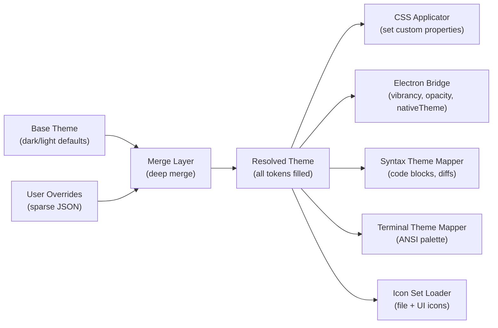

# Theme Engine Design

**Date:** 2026-04-14
**Status:** Approved

## Overview

A full WYSIWYG theme editor built into t3code's settings panel, replacing the current dark/light toggle with a comprehensive theming system. Users can customize colors for every UI surface, typography, window transparency/vibrancy, and icon sets — all through a visual editor with live preview.

## Goals

- Every visual surface in the app is individually customizable
- Changes apply live as the user edits (immediate apply, no preview pane)
- Themes inherit from a base (dark or light) — users only override what they care about
- Themes are stored as JSON files, exportable and importable
- The app remains fully functional for users who never touch theming
- Window-level transparency and macOS vibrancy support

## Data Model

### Theme

```typescript
interface Theme {
  id: string; // UUID
  name: string; // User-facing label, e.g. "My Custom Dark"
  base: "dark" | "light"; // Which built-in theme to inherit from
  overrides: {
    colors?: Partial<ColorTokens>;
    typography?: Partial<TypographyTokens>;
    transparency?: Partial<TransparencyTokens>;
    icons?: IconSetConfig;
  };
  metadata: {
    createdAt: string;
    updatedAt: string;
    version: number; // Schema version for migrations
  };
}
```

### ColorTokens

Maps directly to CSS custom properties, organized by surface:

```typescript
interface ColorTokens {
  // App Chrome
  appChromeBackground: string;

  // Sidebar
  sidebarBackground: string;
  sidebarForeground: string;
  sidebarBorder: string;
  sidebarAccent: string;
  sidebarAccentForeground: string;

  // Main Content
  background: string;
  foreground: string;
  cardBackground: string;
  cardForeground: string;

  // Chat
  // Messages, composer, timestamps

  // Code Blocks
  codeBackground: string;
  codeBorder: string;

  // Terminal (xterm.js ANSI palette)
  terminalBackground: string;
  terminalForeground: string;
  terminalCursor: string;
  terminalBlack: string;
  terminalRed: string;
  terminalGreen: string;
  terminalYellow: string;
  terminalBlue: string;
  terminalMagenta: string;
  terminalCyan: string;
  terminalWhite: string;
  terminalBrightBlack: string;
  terminalBrightRed: string;
  terminalBrightGreen: string;
  terminalBrightYellow: string;
  terminalBrightBlue: string;
  terminalBrightMagenta: string;
  terminalBrightCyan: string;
  terminalBrightWhite: string;

  // Diff
  diffAddedBackground: string;
  diffRemovedBackground: string;

  // Inputs & Controls
  inputBackground: string;
  inputBorder: string;
  primaryButton: string;
  primaryButtonForeground: string;
  secondaryButton: string;
  destructiveButton: string;

  // Borders & Radius
  border: string;
  radius: string;

  // Semantic Status
  info: string;
  infoForeground: string;
  success: string;
  successForeground: string;
  warning: string;
  warningForeground: string;
  destructive: string;
  destructiveForeground: string;
}
```

### TypographyTokens

```typescript
interface TypographyTokens {
  uiFontFamily: string;
  codeFontFamily: string;
  uiFontSize: string; // e.g. "14px"
  codeFontSize: string;
  lineHeight: string;
  customFontUrl?: string; // path to user-loaded font file
}
```

### TransparencyTokens

```typescript
interface TransparencyTokens {
  windowOpacity: number; // 0-1, Electron window level
  vibrancy?: "auto" | "none"; // macOS only
}
```

### IconSetConfig

```typescript
interface IconSetConfig {
  fileIcons: "default" | "material" | "catppuccin" | string;
  uiIcons: "default" | "lucide" | "phosphor" | string;
}
```

### Storage

Themes are stored as JSON files in the user data directory: `<userData>/themes/<id>.json`. The active theme ID is stored in `localStorage` alongside the existing `t3code:theme` key.

## Architecture

### Theme Resolution Pipeline



### Layer 1: ThemeStore

Replaces the current hand-rolled store in `useTheme.ts`. Same `useSyncExternalStore` pattern, but managing a full `ResolvedTheme` instead of just `"light" | "dark" | "system"`.

Responsibilities:

- Load active theme JSON from disk on startup
- Deep-merge overrides onto base theme to produce ResolvedTheme
- Expose subscribe/getSnapshot for React consumption
- Persist changes to JSON file on every edit (debounced, ~300ms)
- Emit change events for non-React consumers (terminal, diff workers)

The existing `useTheme()` hook gets replaced, returning the full resolved theme plus `setToken(path, value)` and `resetToken(path)` for the editor.

### Layer 2: CSS Applicator

A pure function that takes a `ResolvedTheme` and writes CSS custom properties to `document.documentElement.style`. Replaces the current hardcoded `:root {}` and `@variant dark {}` blocks in `index.css`.

On startup:

1. `index.css` still defines the **default** light/dark tokens (fallback if theme engine fails)
2. Theme engine overwrites them via inline styles on `:root`, which takes precedence

The app is always functional even if the theme system breaks — CSS cascade handles the fallback.

### Layer 3: Platform Bridges

Each downstream consumer gets a thin adapter:

- **Electron Bridge** — Extends existing `SET_THEME_CHANNEL` IPC to also send `windowOpacity` and `vibrancy`. Desktop `main.ts` applies `BrowserWindow.setOpacity()`, `BrowserWindow.setVibrancy()`, and `BrowserWindow.setBackgroundColor()`.
- **Syntax Theme Mapper** — Maps the resolved code block colors to a dynamic Shiki theme object instead of switching between two hardcoded themes.
- **Terminal Mapper** — Converts the resolved terminal ANSI tokens into an xterm.js `ITheme` object.
- **Icon Set Loader** — Swaps the icon sprite/lookup based on the active icon set config.

### File Structure

```
apps/web/src/
  theme/
    engine.ts           # ThemeStore, merge logic, persistence
    applicator.ts       # CSS custom property writer
    defaults.ts         # Base dark/light token definitions (moved from CSS)
    types.ts            # Theme, ColorTokens, TypographyTokens, etc.
    syntax-mapper.ts    # Shiki theme generation from tokens
    terminal-mapper.ts  # xterm.js ITheme from tokens
    icon-loader.ts      # Icon set resolution
  hooks/
    useTheme.ts         # Rewritten — thin wrapper around ThemeStore

apps/desktop/src/
    main.ts             # Extended IPC for opacity/vibrancy

packages/contracts/src/
    ipc.ts              # Extended DesktopBridge with new theme properties
```

## Theme Editor UI

### Settings Panel Location

```
Settings
├── General
├── Keybindings
├── Theme Editor        <- new
│   ├── Colors
│   ├── Typography
│   ├── Transparency
│   └── Icons
└── About
```

### Theme Editor Header

At the top of the panel, before the tabs:

- **Theme selector dropdown** — Lists saved themes + "Dark Default" / "Light Default". Selecting one loads it immediately.
- **"New Theme" button** — Prompts for a name, picks a base (dark/light), creates a fresh theme with no overrides.
- **"Duplicate" button** — Copies the current theme as a starting point.
- **"Delete" button** — Removes the current custom theme, falls back to default.
- **"Export" / "Import" buttons** — Export saves the current theme JSON to a user-chosen location. Import loads a `.json` file and adds it to the theme list.
- **"Discard Changes" button** — Reverts all unsaved edits back to the last persisted state. Only visible when there are pending changes.

### Colors Tab

Organized by surface, each as a collapsible section. Each token shows:

- A label (e.g. "Sidebar Background")
- A color swatch showing current value
- Clicking the swatch opens a color picker (hex input + visual picker)
- A reset button that clears the override and reverts to base theme value — only visible when the token has been overridden
- Overridden tokens get a subtle dot indicator

Collapsible sections:

1. App Chrome
2. Sidebar
3. Main Content
4. Chat Messages
5. Code Blocks
6. Terminal (full ANSI 16-color palette)
7. Diff Viewer
8. Inputs & Composer
9. Buttons & Controls
10. Borders
11. Status Colors

### Typography Tab

- **UI Font** — text input with system font autocomplete + "Load custom font..." button (file picker for `.ttf`/`.otf`/`.woff2`)
- **Code Font** — same pattern
- **UI Font Size** — slider with numeric input, range 10-20px
- **Code Font Size** — slider with numeric input, range 10-24px
- **Line Height** — slider, range 1.0-2.0
- Each with a reset button

### Transparency Tab

- **Window Opacity** — slider, 0.5-1.0
- **Window Vibrancy** (macOS only, greyed out on other platforms) — toggle on/off
- Live preview as you drag the slider

### Icons Tab

- **File Icons** — visual grid showing sample file type icons for each available set. Click to select. Sets: Default, Material, Catppuccin.
- **UI Icons** — same grid pattern. Sets: Default (Lucide), Phosphor.
- Each set previewed with ~12 representative icons.

## Electron Transparency

### Constraints

Electron's `transparent: true` and `vibrancy` must be set at window creation time — they cannot be toggled at runtime on macOS.

### Strategy

On first launch, the window is created **opaque** (default). If the user enables transparency in the theme editor, the app stores a flag and prompts for a restart. On next launch, the window is created transparent-ready.

### Window Creation (when transparency enabled)

```typescript
const win = new BrowserWindow({
  transparent: true,
  vibrancy: null,
  backgroundColor: "#00000000",
  hasShadow: true,
  titleBarStyle: "hiddenInset",
});
```

The app's CSS `html`/`body` background provides the actual background color. When the user wants transparency:

- **Opacity mode**: `win.setOpacity(0.85)` — entire window becomes translucent. Works on all platforms.
- **Vibrancy mode (macOS)**: `win.setVibrancy("under-window")` — native blur-behind effect. Body background set to semi-transparent color.

### IPC Extensions

```typescript
interface DesktopBridge {
  setTheme(theme: DesktopTheme): void;
  setWindowOpacity(opacity: number): void;
  setVibrancy(vibrancy: "under-window" | null): void;
  setBackgroundColor(color: string): void;
  getPlatform(): "darwin" | "win32" | "linux";
}
```

### Platform Support

| Feature                 | macOS | Windows | Linux                |
| ----------------------- | ----- | ------- | -------------------- |
| Window opacity          | Yes   | Yes     | Yes                  |
| Vibrancy / blur-behind  | Yes   | No      | No                   |
| Background transparency | Yes   | Yes     | Compositor-dependent |

### Restart Flow

```
User enables transparency ->
  Store transparencyEnabled: true in theme JSON ->
  Show toast: "Restart required for window transparency. Restart now?" ->
  [Restart] -> app relaunches -> main.ts reads flag -> creates transparent window ->
  Theme engine applies opacity/vibrancy from saved theme
```

## Icon Sets

### Structure

```
icons/
  file-icons/
    default/
      manifest.json
      icons/
    material/
      manifest.json
      icons/
    catppuccin/
      manifest.json
      icons/
  ui-icons/
    default/
      manifest.json
      icons/
    phosphor/
      manifest.json
      icons/
```

### File Icon Manifest

```json
{
  "name": "Material",
  "version": "1.0.0",
  "type": "file-icons",
  "mappings": {
    "extensions": {
      ".ts": "typescript.svg",
      ".tsx": "react-ts.svg",
      ".json": "json.svg"
    },
    "filenames": {
      "package.json": "nodejs.svg",
      "Dockerfile": "docker.svg"
    },
    "folders": {
      "src": "folder-src.svg",
      "test": "folder-test.svg"
    },
    "default": "file.svg",
    "defaultFolder": "folder.svg"
  }
}
```

### UI Icon Manifest

```json
{
  "name": "Phosphor",
  "version": "1.0.0",
  "type": "ui-icons",
  "mappings": {
    "sidebar-chat": "chat-circle.svg",
    "sidebar-files": "folder-open.svg",
    "sidebar-settings": "gear.svg",
    "action-send": "paper-plane-right.svg",
    "action-copy": "copy.svg",
    "action-delete": "trash.svg",
    "status-success": "check-circle.svg",
    "status-error": "x-circle.svg"
  }
}
```

### React Components

```tsx
<ThemeIcon name="action-copy" />        // UI icon
<FileIcon path="src/main.ts" />         // File icon
```

### Custom Icon Sets

Users can place an icon set directory in `<userData>/icon-sets/` following the manifest format. It appears automatically in the Icons tab.

## Implementation Phases

### Phase 1: Theme Engine Core + Color Editor

- Define `Theme` types in `packages/contracts`
- Build theme engine: `ThemeStore`, merge logic, CSS applicator
- Extract current hardcoded CSS tokens from `index.css` into `defaults.ts`
- Rewrite `useTheme.ts` to wrap the new engine
- Build Theme Editor settings panel with Colors tab
- Color picker component for each token
- Per-token reset, override indicators
- Debounced persistence to JSON file
- Wire up syntax theme mapper (dynamic Shiki theme from tokens)
- Wire up terminal theme mapper (xterm.js ITheme from tokens)
- Export / Import buttons

**Deliverable:** Full color customization with live preview and persistence.

### Phase 2: Typography + Custom Fonts

- Typography tab in the editor
- System font enumeration via Electron IPC
- Font file loading (`.ttf`/`.otf`/`.woff2` -> `@font-face` injection)
- UI font and code font as separate controls
- Font size and line height sliders
- Persist custom font files to user data directory

**Deliverable:** Full color + typography customization.

### Phase 3: Electron Transparency

- Extend `DesktopBridge` IPC with opacity/vibrancy/platform channels
- Transparency tab in the editor
- Platform detection to disable unsupported features
- Restart-required flow for enabling transparency mode
- Conditional `transparent: true` window creation in `main.ts`
- Opacity slider + vibrancy toggle

**Deliverable:** Window transparency and vibrancy on supported platforms.

### Phase 4: Icon Sets

- Icon manifest format and loader
- `<ThemeIcon>` and `<FileIcon>` components
- Audit all current icon references and replace with themed components
- Bundle Material + Catppuccin file icon sets, Phosphor UI icon set
- Icons tab in the editor with visual grid preview
- Custom icon set directory scanning

**Deliverable:** Full theming system complete.

## Backwards Compatibility

- The existing dark/light/system toggle in General settings continues to work — it selects the "Dark Default" or "Light Default" base theme
- Users who never open the Theme Editor see zero changes in behavior
- The pre-hydration flash prevention script in `index.html` still works — it reads the active theme and applies the resolved background color before React mounts
- `index.css` retains default token definitions as fallback if the theme engine fails
