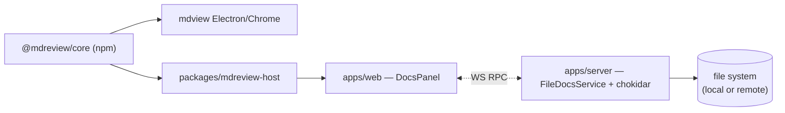

# Docs Browser Design

**Date:** 2026-04-18
**Status:** Proposed

## Overview

Port the core rendering engine from `yaklabco/mdview` into t3code to provide a live markdown + mermaid viewer as a dockable side panel, coexisting with the existing DiffPanel. The panel works identically in local and remote sessions because t3code's server mediates all file access over WebSocket RPC — remote vs. local is not a code-path distinction.

## Goals

- Side panel in t3code that renders markdown and mermaid, triggered by file changes.
- Dual mode: default live-preview of the most recent change; toggle expands to a full file-tree browser.
- Works identically whether the t3code server runs locally or remotely.
- Coexists with DiffPanel in a split right-panel region; both can be visible simultaneously.
- Reuses `@mdreview/core` as a published npm package — no vendoring, no fork.
- Read-only body; a narrow write path permits comment/annotation frontmatter edits.

## Non-Goals

- Inline markdown editing of document bodies (users open their editor via existing `openInPreferredEditor`).
- MDX rendering (treated as plain markdown only if `.mdx` support is added later).
- PDF export (depends on Electron `webContents.printToPDF`, doesn't port cleanly to remote web).
- Replacing `ChatMarkdown` (assistant message rendering stays on `react-markdown` + `remark-gfm`).
- Auto-opening the panel (never surprises the user with a pop-in).

## Decisions

| #   | Topic            | Decision                                                               |
| --- | ---------------- | ---------------------------------------------------------------------- |
| 1   | Panel scope      | Dual-mode: live preview default; toggle to full docs browser           |
| 2   | Feature set      | Core + nice-to-have + comments + DOCX export; no PDF                   |
| 3   | Distribution     | Publish `@mdreview/core` to npm; t3code consumes as dep                |
| 4   | Change detection | Layered: chokidar fs watch + turn-end hint                             |
| 5   | Coexistence      | Split right-panel region — both DiffPanel and DocsPanel can be visible |
| 6   | Editability      | Read-only body; narrow write path for comment frontmatter only         |
| 7   | Theming          | Auto-follow t3code app theme; no picker                                |
| 8   | File scope       | `.md` + `.markdown`; standard exclusions; 5 MB cap; gitignore honored  |
| 9   | Auto-open        | Never. Toast notification with "View" action; user clicks to open      |

## Architecture

Two phases across two repos.

### Why remote works for free

t3code's web never touches the filesystem directly. All file I/O routes through WS RPC to the server, which is the path-safety authority (`WorkspacePathOutsideRootError`). The chokidar watcher runs on the server and streams events over WS. `FileAdapter` in the host wrapper backs onto RPC, not `fs`. Nothing in the web bundle knows whether the server is on `localhost` or another continent.

## Phase A — Publish `@mdreview/core`

Work lives in `yaklabco/mdview`.

### Build

- Add `packages/core/tsup.config.ts`: ESM only, `dts: true`, preserves three subpaths (`.`, `./node`, `./sw`) plus the `./adapters` and `./utils/debug-logger` entries.
- CSS is copied verbatim to `dist/styles/` (not bundled).
- Add `"build": "tsup"` and `"prepublishOnly": "bun run build && bun run test:ci"` to `packages/core/package.json`.

### Package shape

- `version`: `0.0.1` → `0.1.0`.
- `exports`: flip from `./src/*.ts` to dual `{ "import": "./dist/*.js", "types": "./dist/*.d.ts" }` for each subpath. `./styles/content.css` stays pointing at source CSS.
- `files`: `["dist", "styles"]`.
- `publishConfig`: `{ "access": "public" }`.

### Release

- Reuse existing release-please configuration. Add a channel for `@mdreview/core`.
- New `.github/workflows/publish-core.yml` triggers on the release-please `@mdreview/core-v*` tag and runs `bun publish --access public`.
- `NPM_TOKEN` as repo secret.

### Downstream in mdview

`@mdreview/chrome-ext` and `@mdreview/electron` continue using `workspace:*` locally (fast dev), but CI artifacts resolve against the published version for parity with third-party consumers.

### Versioning contract

- Breaking adapter-interface changes → major bump.
- New plugins or themes → minor bump.
- Bug fixes → patch.

## Phase B — t3code integration

### Contracts (`packages/contracts/src/project.ts` + `rpc.ts`)

Three new RPCs added to `WS_METHODS` and registered in `WsRpcGroup`.

**`projectsReadFile`** (request/response)

- Payload: `{ cwd, relativePath }`
- Success: `{ contents, relativePath, size, mtimeMs }`
- Errors: `NotFound | TooLarge | PathOutsideRoot | NotReadable`

**`subscribeProjectFileChanges`** (stream)

- Payload: `{ cwd, globs: ["**/*.md", "**/*.markdown"], ignoreGlobs: [...] }`
- Success event variants (tagged union):
  - `snapshot` — initial list of matching files (`{ path, size, mtime }[]`)
  - `added` / `changed` / `removed` — per-file events
  - `turnTouchedDoc` — emitted by the thread runtime on turn completion; payload `{ threadId, turnId, paths }`

Modeled structurally on `subscribeGitStatus`: Effect `Stream` + broadcaster, one watcher per `cwd`, ref-counted, chokidar torn down when last subscriber leaves.

**`projectsUpdateFrontmatter`** (request/response)

- Payload: `{ cwd, relativePath, frontmatter }`
- Parses YAML frontmatter, replaces only the `comments` key, writes back atomically (temp file + rename). Body bytes preserved exactly.
- Errors: `FrontmatterInvalid | ConcurrentModification | PathOutsideRoot`

### Server (`apps/server/src/rpc/handlers/projectFiles.ts`)

`FileDocsService` responsibilities:

- Path safety via existing `WorkspacePaths.resolveSafe`.
- One chokidar instance per `cwd`. Respects `.gitignore` plus hard-coded ignores (`node_modules`, `.git`, `dist`, `out`, `.turbo`, `.next`, `target`).
- 150ms debounce per path to coalesce rapid saves.
- Self-echo suppression: each `projectsUpdateFrontmatter` write tags the path with a token; watcher drops matching events within a 500ms window.
- Size cap (5 MB). Oversized files appear in `snapshot` with `oversized: true` and fail `projectsReadFile` with `TooLarge`.

Turn-touch detection: hook at the "turn complete" boundary in the existing thread runtime. Collect `.md` paths written through `projectsWriteFile` during the turn and emit one `turnTouchedDoc` event per subscription.

### Host wrapper (`packages/mdreview-host`)

Thin integration package. Zero rendering logic.

- **`FileAdapter`** — `readFile` → `projectsReadFile`; `watchFile` → filtered `subscribeProjectFileChanges`; `listFiles` → served from the `snapshot` event.
- **`StorageAdapter`** — `localStorage`, namespaced `t3code:mdreview:*`. Stores split ratio, browser-mode toggle, recent-docs list. No server involvement.
- **`MessagingAdapter`** — null implementation. mdview's core degrades gracefully when omitted.

Exports a single `MdreviewRenderer` React component that composes `@mdreview/core`'s `RenderPipeline` with the host adapters.

### Web UI (`apps/web`)

**Split right-panel layout.** `DiffPanelInlineSidebar` in `routes/_chat.$environmentId.$threadId.tsx` is replaced with `RightPanelRegion`, a vertical `ResizablePanelGroup`:

- Top: `DiffPanel` (unchanged behavior)
- Bottom: `DocsPanel`

Each independently closable; closed sibling cedes full height to the other. Split ratio persists in user prefs. Mobile (`<1180px`): both fall back to sheet mode, tabbed within the sheet.

**`DocsPanel`** at `apps/web/src/components/DocsPanel.tsx`:

- Live-preview mode (default): most recent doc, breadcrumb header, close + mode toggle.
- Browser mode: file tree on left, preview on right. Mode toggle persists per session.
- Renders via `<MdreviewRenderer />` from the host wrapper.

**State.** Route search params: `?docs=1&docsPath=<rel>&docsMode=preview|browser`. Parsed in a new `docsRouteSearch.ts` parallel to `diffRouteSearch.ts`. Recent-docs list in per-thread Zustand slice. File-tree snapshot in an Effect Atom family keyed by `cwd` so multiple views share one subscription.

**Toast.** On `turnTouchedDoc`, or on the first `changed` event for a path that's not currently the open preview, fire a sonner toast: `"docs/plan.md updated"` with a "View" action that sets the route params.

**ChatMarkdown unchanged.** Different scope (small inline bubbles vs. full-page docs) and different expectations.

## UX flows

- **First trigger.** Agent writes `docs/plan.md`. Server emits `turnTouchedDoc`. Toast appears. User clicks "View" → DocsPanel opens in live-preview mode.
- **Subsequent change, panel open.** Scroll-preserving hot reload via mdview core.
- **Subsequent change, panel closed.** Toast fires again.
- **Manual browse.** User clicks docs toggle in the right-panel region. Empty state with browser-mode toggle → file tree appears on toggle.
- **Comment edit.** User adds annotation → `projectsUpdateFrontmatter` RPC → atomic write → watcher event suppressed (self-echo window) → optimistic UI already matches.
- **Simultaneous diff + docs.** Resize handle between the two panels allocates vertical space.

## Testing

### Phase A

- `npm publish --dry-run` to validate the `exports` flip.
- Consumer fixture project imports `@mdreview/core` from `dist/` and renders a string with a mermaid block. Runs in mdview CI after build.
- Existing vitest suite kept as-is.

### Phase B

- `FileDocsService` vitest: path-safety, size cap, debounce coalescing, self-echo suppression, gitignore honored, snapshot completeness, teardown on last-subscriber-leaves.
- Contract round-trip tests for all new schemas.
- Adapter tests: `FileAdapter` against mocked RPC client (happy + each error), `StorageAdapter` against `localStorage` polyfill, null `MessagingAdapter` under expected call patterns.
- Playwright: scaffold fixture thread with `.md`, assert render, assert toast on external write, assert mode toggle, assert split-panel resize persists.
- One Playwright spec against a local server and one against a remote server URL — proves the unified WS RPC boundary.

## Rollout

Smallest-first, each step shippable alone.

1. Phase A: publish `@mdreview/core`.
2. Contracts-only PR: schemas + method table. No functional impact.
3. Server PR: `FileDocsService` + handlers. No web consumer yet.
4. Host wrapper PR: `packages/mdreview-host` with adapters and renderer component.
5. Web PR: `DocsPanel`, split right-panel layout, toast wiring. Feature live end-to-end.
6. Dogfood one week; fix what bites; announce.

No feature flag — each step is a coherent unit, and the UI is opt-in by user action.

## Open questions

None blocking. Items that may surface during implementation:

- Exact default split ratio between DiffPanel and DocsPanel.
- Whether the browser-mode file tree respects directory collapsing state across reloads.
- Whether to expose the 5 MB size cap as user-configurable (default until proven otherwise: no).
