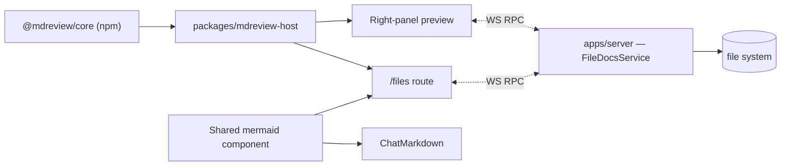

# Files Browser Design

**Date:** 2026-04-19
**Status:** Proposed
**Supersedes:** 2026-04-18-docs-browser-design.md

## Overview

A full project file browser at `/files` and a lightweight right-panel doc preview during chat. Markdown files are rendered via `MdreviewRenderer` from `@mdreview/core`; all other files get syntax-highlighted code view via Pierre/Shiki. Mermaid code blocks in chat messages are rendered as diagrams with a Preview/Source toggle. Comments and annotations use `@mdreview/core`'s existing comment functionality backed by frontmatter.

Works identically in local and remote sessions — all file I/O routes through the server's WebSocket RPCs.

## Goals

- Full-page `/files` route for browsing all project files, navigable from the sidebar.
- Lightweight right-panel preview that auto-surfaces when the AI touches docs during a turn.
- Mermaid diagram rendering in chat messages (Preview/Source toggle).
- Reuses `@mdreview/core` as a published npm package and existing `packages/mdreview-host` adapters.
- Read-only body; comment/annotation edits via `@mdreview/core`'s frontmatter comment system.

## Non-Goals

- Inline markdown editing of document bodies (users open their editor via existing `openInPreferredEditor`).
- MDX rendering.
- PDF or DOCX export.
- Replacing `ChatMarkdown` wholesale (only adding mermaid block handling).
- Feature flags — each phase is a coherent shippable unit.

## Decisions

| #   | Topic                  | Decision                                                             |
| --- | ---------------------- | -------------------------------------------------------------------- |
| 1   | Primary view           | Full-page `/files` route, not a panel toggle                         |
| 2   | Navigation             | Sidebar footer link, next to Settings                                |
| 3   | File scope             | All project files, not just markdown                                 |
| 4   | Non-markdown rendering | Syntax-highlighted code view (Pierre/Shiki) with "Open in Editor"    |
| 5   | Right panel            | Single-slot swap (DiffPanel OR PlanSidebar OR DocPreview), not split |
| 6   | Auto-surface           | Right panel opens on `turnTouchedDoc`; clickable file paths in chat  |
| 7   | Chat enhancement       | Mermaid code blocks rendered as diagrams with Preview/Source toggle  |
| 8   | Comments               | `@mdreview/core`'s existing comment system, no new invention         |
| 9   | Theming                | Auto-follow app theme (light/dark)                                   |
| 10  | Editability            | Read-only body; narrow write path for comment frontmatter only       |

## Architecture



### Component reuse

- `MdreviewRenderer` — used by `/files` route viewer and right-panel preview for markdown.
- Pierre/Shiki highlighter — used by `/files` route viewer, right-panel preview, and existing DiffPanel for non-markdown.
- Mermaid rendering component — shared between `ChatMarkdown` code block handler and `MdreviewRenderer`.

## `/files` Route

### Layout

```
+------------------+----------------------------+
|  App Sidebar     |  /files                    |
|  (existing)      |  +--------+--------------+ |
|                  |  | File   | File Viewer   | |
|  Projects        |  | Tree   |              | |
|  Threads         |  |        | MdreviewRen  | |
|  ...             |  |        | or Shiki     | |
|                  |  |        |              | |
|  [Files]  <--    |  |        |              | |
|  [Settings]      |  +--------+--------------+ |
+------------------+----------------------------+
```

### Navigation

- New `SidebarMenuButton` in the sidebar footer, next to Settings.
- Route: `/files` (no file selected) or `/files?file=relative/path` (deep-link to file).
- Shows files for the currently selected project. If no project is selected, prompts to pick one.
- Switching projects in the sidebar updates the file tree.

### File Tree (Left Pane)

- **Data source:** `subscribeProjectFileChanges` stream. Snapshot on mount, live updates thereafter.
- **Structure:** Directories first, then files, alphabetical. Collapsible directory nodes.
- **Icons:** Existing `VscodeEntryIcon` component.
- **Filtering:** Search bar at top, filters by file name/path as you type.
- **Visual cues:** Markdown files get a subtle accent. Oversized files (>5MB) shown greyed with tooltip.
- **Excluded:** `.gitignore`d files and hardcoded ignores (node_modules, .git, dist, etc.) — handled by FileDocsService's chokidar config.
- **Persistence:** Directory expansion state stored in localStorage via `T3StorageAdapter`.

### File Tree Interactions

- **Single click:** Select file, show in viewer.
- **Double click:** Open in editor.
- **Right click:** Context menu — "Open in Editor", "Copy Path", "Copy Relative Path". Native menu on Electron via `desktopBridge.showContextMenu()`, fallback menu on web.

### File Viewer (Right Pane)

**Markdown files (`.md`, `.markdown`):**

- Rendered via `MdreviewRenderer` from `packages/mdreview-host`.
- Full GFM support, mermaid diagrams rendered inline.
- Live-updating from the watch stream.
- Frontmatter displayed in a collapsible header (clean key/value, not raw YAML).
- Comments via `@mdreview/core`'s existing comment functionality.

**All other files:**

- Syntax-highlighted via Pierre/Shiki.
- Read-only code view with line numbers.
- Language auto-detected from file extension.
- Live-updating from the watch stream.

**Shared chrome:**

- **Toolbar:** Breadcrumb path, file size, last modified.
- **Actions:** "Open in Editor" (primary), "Copy Path" (secondary).
- **Empty state:** "Select a file from the tree" with keyboard shortcut hint.
- **Error states:** Not found, too large (>5MB), path outside root — each with clear message.
- **Scroll position:** Remembered per file within the session.

## Right-Panel Doc Preview

A minimal viewer in the same right-panel slot as DiffPanel and PlanSidebar. Only one panel active at a time — opening DocPreview closes DiffPanel/PlanSidebar and vice versa.

### Trigger: search params

Controlled via URL search params (existing pattern). DocPreview uses `?preview=relative/path/to/file`.

### How it opens

**1. Auto-surface on `turnTouchedDoc`:**
When a turn completes and the AI modified files, the panel opens automatically showing the first touched file. If multiple files were touched, a small file list/tab bar at the top to switch between them. User can dismiss.

**2. Clickable file paths in chat messages:**
File paths mentioned by the AI already get "Open in Editor" decoration. Add a second action — "Preview" — that opens the file in the right panel. Works for any file type.

### Panel contents

- **Header:** Truncated file path (tooltip for full), "Open in Editor", "Open in Files" (navigates to `/files?file=...`), close button.
- **Body:** `MdreviewRenderer` for markdown, Pierre/Shiki for everything else.
- **Live-updating:** Subscribed to watch stream for the displayed file.
- **Mobile:** Renders as sheet/modal (same responsive pattern as DiffPanel).

## Mermaid in Chat

The existing `ChatMarkdown` component gets a custom code block handler for `mermaid` fenced blocks. No other changes to chat rendering.

### Behavior

- Fenced ` ```mermaid ` blocks render as diagrams instead of raw code.
- Small tab bar on the block: **Preview** (default) | **Source**.
- Preview shows rendered mermaid diagram.
- Source shows current syntax-highlighted code block (existing behavior).
- Copy button works in both modes (always copies raw mermaid source).

### Rendering

- Shared mermaid component (wrapping `mermaid.js`), reused by `MdreviewRenderer`.
- Client-side rendering.
- Invalid syntax falls back to source view with error indicator.
- Respects current theme (light/dark).
- Diagram scrollable on overflow.
- Consistent padding/border with existing code blocks.

## Data Flow

### RPC Client additions

Three new methods added to `wsRpcClient.ts` projects namespace:

- `readFile(input)` — one-shot file read.
- `updateFrontmatter(input)` — atomic frontmatter write (for comments).
- `subscribeProjectFileChanges(input)` — stream subscription.

### Adapter wiring

`T3FileAdapter` from `packages/mdreview-host` expects a generic `RpcClient`. A thin adapter maps `wsRpcClient` methods to that shape. One instance per active project.

### Subscription lifecycle

- **`/files` route:** Subscribe on mount, unsubscribe on unmount. Snapshot populates tree, subsequent events update it.
- **Right-panel preview:** Subscribe scoped to viewed file. Unsubscribe on close or file change.
- **Shared subscription:** If both active, share the underlying stream. Server already ref-counts per-cwd watchers; client should be smart about this too.

### State management

- **File tree state:** Effect Atom family keyed by `cwd` (fits existing `AtomRegistry` pattern for streaming data).
- **Selected file content:** TanStack Query keyed by `[projectId, filePath]`, invalidated by watch events.
- **UI state:** Tree expansion, selected file in Zustand store. Panel open/closed via URL search params.

## Implementation Phases

### Phase B4a: RPC Client & Shared Components

- Add `readFile`, `updateFrontmatter`, `subscribeProjectFileChanges` to `wsRpcClient.ts`.
- Add `@t3tools/mdreview-host` dependency to `apps/web`.
- Create `RpcClient` adapter bridging `wsRpcClient` → `T3FileAdapter`.
- Extract shared `FileViewer` component (markdown via `MdreviewRenderer`, code via Pierre/Shiki).
- Extract shared mermaid rendering component.

### Phase B4b: Mermaid in Chat

- Custom mermaid code block handler in `ChatMarkdown`.
- Preview/Source tab toggle.
- Theme-aware rendering.
- Shares mermaid component from B4a.

### Phase B4c: `/files` Route

- New route with file tree (left) + viewer (right).
- Sidebar navigation link next to Settings.
- File tree powered by `subscribeProjectFileChanges` stream.
- Context menus (native on Electron, fallback on web).
- Deep-linking via `?file=path`.

### Phase B4d: Right-Panel Doc Preview

- Panel component in DiffPanel/PlanSidebar slot.
- `turnTouchedDoc` auto-surface wiring.
- Clickable file path "Preview" action in chat messages.
- "Open in Files" link to jump to full route.

## Testing

### Unit (Vitest)

- RPC adapter mapping (happy path + each error variant).
- File tree state logic (snapshot ingestion, incremental updates, filtering).
- Mermaid toggle behavior (preview/source switching, error fallback).

### Component (@testing-library/react + happy-dom)

- `FileViewer` renders markdown via MdreviewRenderer and code via Shiki.
- Mermaid code block handler renders diagram and toggles to source.
- File tree renders directory structure, handles selection, context menu.

### Integration

- `bun dev` (server + web), open a project with markdown files.
- File tree populates from snapshot.
- Modify a file externally, confirm live-update in viewer.
- Frontmatter comment edit round-trips correctly.

### E2E (Playwright)

- Navigate to `/files`, select a markdown file, verify rendered output.
- Select a `.ts` file, verify syntax highlighting.
- Open a chat, trigger a turn that modifies markdown, verify right panel auto-surfaces.
- Click file path in chat message, verify right panel opens.
- Mermaid block in chat message renders as diagram, toggle shows source.

### Electron-specific

- Context menus use native menus via `desktopBridge.showContextMenu()`.
- "Open in Editor" dispatches correctly.
- File tree icons render via `VscodeEntryIcon`.

## Open Questions

None blocking. Items that may surface during implementation:

- Exact keyboard shortcut to toggle the `/files` route (Cmd+Shift+F? Cmd+E?).
- Whether the file tree should show file counts per directory.
- Whether "Open in Files" from the right panel should preserve chat scroll position on back-navigation.
