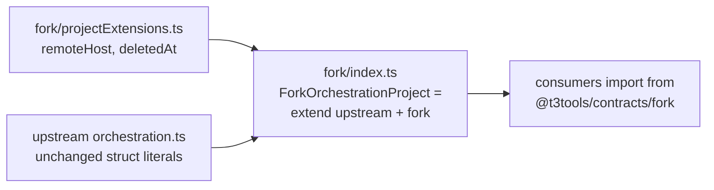
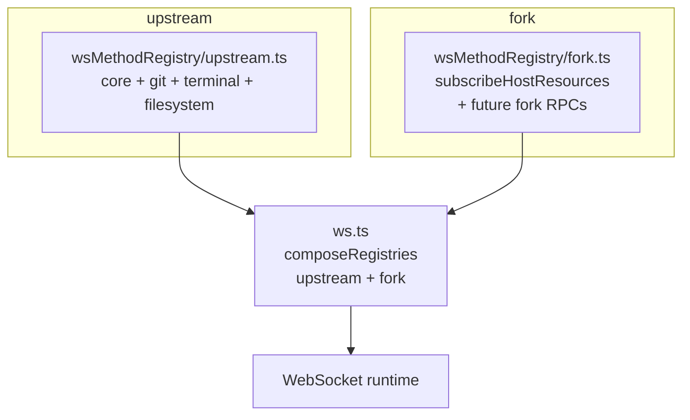
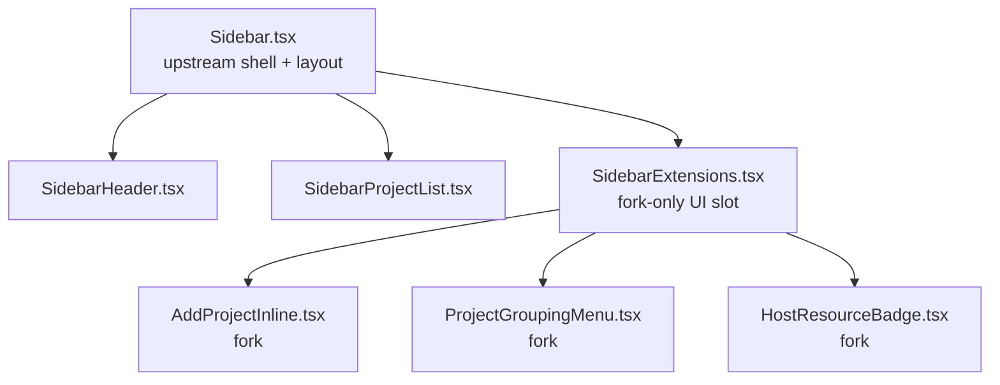

# Implementation Plan — Reduce Upstream Merge Conflict Surface

## Goal

Shrink the files and lines where fork-only code lives alongside upstream-churning code so future syncs become mechanical. Target a **>75% reduction** in conflict-bearing lines in `Sidebar.tsx`, `packages/contracts/src/orchestration.ts`, and `apps/server/src/ws.ts`.

## Approach summary

| Hotspot                                                | Upstream churn (90d) | Strategy                                  | Technique             |
| ------------------------------------------------------ | -------------------- | ----------------------------------------- | --------------------- |
| `Sidebar.tsx` (3712 lines)                             | 156 commits          | Extract fork UI into sibling components   | Component composition |
| `packages/contracts/src/orchestration.ts` (1229 lines) | 244 commits          | Move fork schemas to a new fork-only file | `Schema.extend`       |
| `apps/server/src/ws.ts` (1114 lines)                   | 15 commits           | Registry pattern for RPC method handlers  | Layer composition     |

Order matters: **contracts first** (types flow everywhere), **ws.ts second** (server-side only), **Sidebar.tsx last** (UI touches both).

---

## Phase 1 — Contracts extension module

### Current problem

`orchestration.ts` has fork fields interleaved with upstream struct literals:

- `OrchestrationProject` at line 156 — fork added `remoteHost` (161), `deletedAt` (166)
- `OrchestrationProjectShell` at line 323 — fork added `remoteHost` (328), `deletedAt` (333)
- Several other structs at lines 418, 764, 783, 803

Every time upstream edits these structs, we re-resolve.

### Target architecture



### Steps

1. **Create `packages/contracts/src/fork/` folder**
   - `fork/projectExtensions.ts` — defines the fork-only fields as their own schema
     ```ts
     export const ProjectForkFields = Schema.Struct({
       remoteHost: Schema.optional(RemoteHost),
       deletedAt: Schema.NullOr(IsoDateTime),
     });
     ```
   - `fork/index.ts` — re-exports composed types:
     ```ts
     export const OrchestrationProject = Schema.extend(
       UpstreamOrchestrationProject,
       ProjectForkFields,
     );
     export type OrchestrationProject = typeof OrchestrationProject.Type;
     ```

2. **Rename upstream structs in-place** (one-time invasive change)
   - In `orchestration.ts`: `OrchestrationProject` → `UpstreamOrchestrationProjectBase`
   - Export both names initially: `export const OrchestrationProject = UpstreamOrchestrationProjectBase` (alias) until consumers migrate
   - Remove all fork fields (`remoteHost`, `deletedAt`) from the upstream file

3. **Consumer migration**
   - Find every import site: `grep -r "OrchestrationProject" apps/ packages/`
   - Replace `from "@t3tools/contracts"` → `from "@t3tools/contracts/fork"` where the fork shape is needed
   - Leave pure-upstream consumers on the base type

4. **Delete the alias** once all consumers migrated

5. **Repeat for** `OrchestrationProjectShell`, and the other structs at lines 418, 764, 783, 803

### Acceptance

- Zero fork fields in `orchestration.ts`
- `bun run typecheck` passes
- Merging upstream changes to any of the 5 structs produces **zero conflicts** (fork extension is in a separate file)

### Risk

- `Schema.extend` semantics with `Schema.optional` and `withDecodingDefault` — verify behavior with a dedicated test (encode/decode round-trip with missing fields)
- Breaking change for any external `@t3tools/contracts` consumers (none today — monorepo only)

---

## Phase 2 — WebSocket method registry

### Current problem

`ws.ts:750–1082` — one massive object literal of method → handler. Fork added `subscribeHostResources` (line 1063) inline. Every upstream method change conflicts if adjacent.

### Target architecture



### Steps

1. **Extract the handler map type** into `apps/server/src/rpc/wsMethodRegistry.ts`:

   ```ts
   export type WsMethodHandler<K extends keyof typeof WS_METHODS> = (
     input: WsMethodInput<K>,
   ) => Effect.Effect<WsMethodOutput<K>, WsMethodError<K>, WsMethodContext<K>>;

   export type WsMethodRegistry = {
     readonly [K in keyof typeof WS_METHODS]?: WsMethodHandler<K>;
   };

   export function composeRegistries(...registries: WsMethodRegistry[]): WsMethodRegistry {
     return Object.assign({}, ...registries);
   }
   ```

2. **Split handlers by domain** into files under `apps/server/src/rpc/handlers/`:
   - `core.ts` — server config/settings/lifecycle (upstream)
   - `projects.ts` — search/write/browse (upstream)
   - `git.ts` — all `git.*` methods (upstream)
   - `terminal.ts` — `terminal.*` methods (upstream)
   - `orchestration.ts` — from `ORCHESTRATION_WS_METHODS` (upstream)
   - **`fork.ts` — `subscribeHostResources` + any future fork RPC**

   Each exports a `WsMethodRegistry` literal. No cross-file merge surface.

3. **`ws.ts` becomes thin**:

   ```ts
   const registry = composeRegistries(
     coreHandlers,
     projectsHandlers,
     gitHandlers,
     terminalHandlers,
     orchestrationHandlers,
     forkHandlers, // ← our additions, never touched by upstream
   );
   ```

4. **Migrate test setup**: `server.test.ts` already provides layers; composing from registry files requires only passing the same layer context — no behavior change.

### Acceptance

- `ws.ts` contains no handler bodies, only layer wiring + composition
- Fork RPC methods live in `handlers/fork.ts` and nothing else
- `subscribeHostResources` moves from `ws.ts:1063` → `handlers/fork.ts` with zero functional change

### Risk

- Handler closures currently share local helpers (`observeRpcStreamEffect`, etc.) — export these from a shared module
- Some handlers depend on `currentSessionId` captured via `makeWsRpcLayer` closure — refactor to pass through Layer service rather than closure

---

## Phase 3 — Sidebar composition split

### Current problem

`Sidebar.tsx` is **3712 lines** and accrues ~1.7 upstream commits/day. Fork features (add-project flow, grouping, host resource integration) live inline inside the main `Sidebar()` component function.

### Target architecture



### Steps

1. **Audit fork additions in Sidebar.tsx**
   Known fork code from merge conflicts:
   - Add-project inline flow: `addingProject`, `newCwd`, `isPickingFolder`, `isAddingProject`, `addProjectError`, `addProjectInputRef`, `addProjectFromInput` (~150 lines, line 2835+)
   - Grouping mode logic (`SidebarProjectGroupingMode`)
   - Host resource indicator integration
   - Linux-platform folder-picker branching

   Run `git log --follow -p apps/web/src/components/Sidebar.tsx` between `main` base and fork tip to get an authoritative diff.

2. **Extract add-project flow** → `components/sidebar/AddProjectInline.tsx`
   - Props: `{ environmentId, onProjectCreated }`
   - Owns: all add-project state hooks, `addProjectFromInput`, folder-picker logic
   - Uses existing `useStore`/`useSettings` hooks directly

3. **Extract grouping menu** → `components/sidebar/ProjectGroupingMenu.tsx`
   - Owns: `SidebarProjectGroupingMode` state + UI
   - Pure presentational where possible

4. **Introduce a fork extension slot in Sidebar.tsx**

   ```tsx
   // inside Sidebar()
   return (
     <aside>
       <SidebarHeader />
       <SidebarExtensionsTop /> {/* ← fork-only, <10 lines of JSX */}
       <SidebarProjectList>
         {(project) => (
           <>
             <UpstreamProjectRow project={project} />
             <SidebarProjectExtensions project={project} /> {/* ← fork-only */}
           </>
         )}
       </SidebarProjectList>
     </aside>
   );
   ```

   The fork's footprint in `Sidebar.tsx` shrinks to just the extension-slot JSX tags.

5. **Extract host resource badge** → `components/sidebar/HostResourceBadge.tsx` (may already exist under `chat/`; verify before creating)

### Acceptance

- `Sidebar.tsx` diff vs `origin/main` shrinks to **<50 lines** (extension slots + imports)
- All existing tests pass (`Sidebar.test.tsx`, browser tests)
- Fork UI behavior identical

### Risk

- `Sidebar.tsx` uses lots of local state and refs shared between sections — extracting may require lifting state up via context or passing handler props
- `dnd-kit` drag context wraps projects — extracted components must stay within it
- Some code paths (keyboard shortcuts) may couple add-project state to top-level handlers — audit carefully

---

## Phase 4 — Validation and codification

1. **Establish conflict metrics baseline**
   - Before: record `git diff --stat main..HEAD -- <hotspot>` per file.
   - After: same command should show the file near-unchanged vs main.

2. **Add CI check**: warn if a PR touches both upstream and fork concerns in the same file
   - Use `.github/CODEOWNERS` mapping fork-specific paths to the fork owner
   - Add a lint rule (or custom script) that flags diffs in `ws.ts`, `Sidebar.tsx`, `orchestration.ts` in any non-sync PR — push devs toward the extension files

3. **Document the pattern** in `CONTRIBUTING.md` (fork-local)
   - "New RPC method? Add to `handlers/fork.ts`"
   - "New contract field extending an upstream struct? Create a schema in `contracts/src/fork/`"
   - "New Sidebar feature? Extract a component under `sidebar/` and wire via an extension slot"

4. **Run a synthetic sync test**
   - Cherry-pick a recent upstream churn commit (e.g., a `Sidebar.tsx` edit from upstream) onto our branch
   - Verify zero conflicts
   - Revert

---

## Sequencing and sizing

| Phase             | Scope                                   | Risk                                  | Suggested PR count      |
| ----------------- | --------------------------------------- | ------------------------------------- | ----------------------- |
| 1. Contracts      | 1 folder + ~5 consumer migrations       | Medium (types flow everywhere)        | 2-3 PRs (1 per struct)  |
| 2. ws.ts registry | 1 new module + 6 handler files + rewire | Low (server-only, well-tested)        | 1 PR                    |
| 3. Sidebar split  | 3-4 extracted components + slot wiring  | Medium-High (UI regressions possible) | 3 PRs (one per feature) |
| 4. Codification   | CI + docs                               | Low                                   | 1 PR                    |

Total: **~7–8 PRs**. Each independently merge-safe. Do **not** batch — small, reviewable units.

## Recommended order

1. **Phase 2 (`ws.ts`) first** — smallest blast radius, validates the registry pattern cheaply
2. **Phase 1 (contracts)** — now the team has confidence in the "extension module" approach
3. **Phase 3 (Sidebar)** — largest refactor, done last with the most review rigor
4. **Phase 4 (codification)** — lock in the gains

## Exit criteria

After all phases: pulling 2 weeks of upstream should resolve in **under 30 minutes** with zero contract/`ws.ts` conflicts and localized, mechanical `Sidebar` conflicts (if any).
